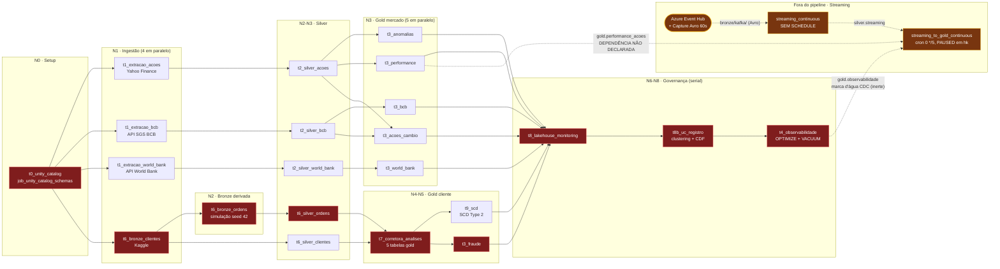

# A1 — FLUXO E ORQUESTRAÇÃO

> **Fonte da ordem:** `databricks.yml` (Databricks Asset Bundles), job
> `pipeline_completo`. **Não há Control-M.** `dags/dag_pipeline_santander.py` é
> espelho gerado — ver §1.5.
>
> **Procedência da leitura:** branch `release/segunda-chance-dm`, commit
> **`c2a8811`** (`git rev-parse --short HEAD`). Working tree suja apenas em
> documentação (`M README.md`, `M docs/README.md`, `?? EXECUTIVE_SUMMARY.md`).
> **O INVENTARIO.md foi escrito sobre `f7265c7`**; entre `f7265c7` e `c2a8811`
> mudaram `INVENTARIO.md`, `docs/prompts/engenharia-reversa-GENERICO.md` e
> **`src/gold/fraude.py`** (`git diff --name-only f7265c7 HEAD`). Toda linha de
> `src/gold/fraude.py` citada aqui foi relida no código atual — as do INVENTARIO
> estão defasadas (§6.4).
>
> Toda afirmação tem `arquivo:linha`. O que não pude confirmar está marcado
> `[NÃO CONFIRMADO]`.

---

## 1. ORDEM DE EXECUÇÃO GLOBAL

### 1.1 O que existe de orquestração

| Item | Valor | Evidência |
|---|---|---|
| Definições de job no bundle | **9** | `databricks.yml:39,70,100,130,160,190,221,253,287` |
| Jobs com `schedule` | **2** | `databricks.yml:281-284` e `:779-782` (só duas ocorrências de `quartz_cron_expression`) |
| Tasks no `pipeline_completo` | **22** | `databricks.yml:297`–`:755` |
| Arestas `depends_on` | **22** | uma por task exceto a raiz `t0_unity_catalog`; `t3_acoes_cambio` (`:618-619`), `t7_corretora_analises` (`:641-642`) e `t8_lakehouse_monitoring` (`:708-714`) têm múltiplos predecessores |
| `entry_point` distintos usados no bundle | **24** | `grep -oE 'entry_point: [a-z_]+' databricks.yml \| sort -u \| wc -l` → 24 |
| `console_scripts` declarados | **24** | `setup.py:27-50` |
| `max_concurrent_runs` / `condition_task` / `run_if` | **0 ocorrências** | `grep -nE 'max_concurrent_runs\|condition_task\|run_if' databricks.yml` → vazio |
| `email_notifications` / `webhook_notifications` | **0 ocorrências** | mesmo grep → vazio (§5.1) |

Como não há nenhum `run_if`, vale o default do Databricks Jobs
(`ALL_SUCCESS`): **uma task que falha bloqueia todas as sucessoras**, que ficam
`Upstream failed`. Isso é o contrário do que acontece com as falhas *silenciosas*
da §5 — lá a task fica `Succeeded` e as sucessoras rodam com dado velho ou
inexistente.

### 1.2 Sequência real ponta a ponta — `pipeline_completo`

Agendamento do job inteiro: `0 0 6 * * ?` · `America/Sao_Paulo` · `UNPAUSED`
(`databricks.yml:779-782`). Todas as tasks abaixo herdam esse agendamento; nenhuma
task tem cron próprio. `spark_env_vars.ENVIRONMENT: ${var.environment}` está
presente em todas.

Nível = profundidade topológica derivada do `depends_on` (não da leitura do código).

| Nív | # | `task_key` | `entry_point` | script | Predecessores | Tabelas/paths **lidos** | Tabelas/paths **escritos** |
|---|---|---|---|---|---|---|---|
| **N0** | 1 | `t0_unity_catalog` (`:297`) | `job_unity_catalog_schemas` (`:301`) | `jobs/job_unity_catalog_schemas.py` | — (raiz) | — | `CREATE SCHEMA IF NOT EXISTS` × 3: `SCHEMA_BRONZE`, `SCHEMA_SILVER`, `SCHEMA_GOLD` (`jobs/job_unity_catalog_schemas.py:41-42`) |
| **N1** | 2 | `t1_extracao_acoes` (`:317`) | `job_extracao_acoes` (`:323`) | `jobs/job_extracao_acoes.py` | `t0` (`:320`) | Yahoo Finance (`src/ingestion/yahoo_finance.py:49-50`, `period="2y"`) | path `bronze/acoes/data=<data>/` Parquet overwrite (`yahoo_finance.py:71-73`) |
| **N1** | 3 | `t1_extracao_bcb` (`:338`) | `job_extracao_bcb` (`:344`) | `jobs/job_extracao_bcb.py` | `t0` (`:341`) | API SGS BCB (`src/ingestion/bcb.py:49-52`), séries 11/1/433 (`:158-164`) | path `bronze/bcb/extracao=<data>/` Parquet overwrite (`bcb.py:181-183`) |
| **N1** | 4 | `t1_extracao_world_bank` (`:359`) | `job_extracao_world_bank` (`:365`) | `jobs/job_extracao_world_bank.py` | `t0` (`:362`) | API World Bank (`src/ingestion/world_bank.py:46`), 2 indicadores (`:80-81`) | path `bronze/world_bank/extracao=<data>/` Parquet overwrite (`world_bank.py:92-94`) |
| **N1** | 5 | `t6_bronze_clientes` (`:380`) | `job_bronze_clientes` (`:386`) | `jobs/job_bronze_clientes.py` | `t0` (`:383`) | Kaggle HTTP (`src/ingestion/clientes_kaggle.py:51-56`) | `bronze.clientes` — MERGE por `hash_cliente` (`clientes_kaggle.py:104-105` → `src/utils/delta.py:27-44`) |
| **N2** | 6 | `t2_silver_acoes` (`:468`) | `job_silver_acoes` (`:474`) | `jobs/job_silver_acoes.py` | `t1_extracao_acoes` (`:471`) | path `bronze/acoes/` (`src/transformation/silver_acoes.py:22,27`) | path `silver/acoes/` Delta overwrite, `partitionBy(ano,mes)` (`:66-71`); **registra** `silver.acoes` (`:89`) |
| **N2** | 7 | `t2_silver_bcb` (`:489`) | `job_silver_bcb` (`:495`) | `jobs/job_silver_bcb.py` | `t1_extracao_bcb` (`:492`) | path `bronze/bcb/extracao=*/` (`src/transformation/silver_bcb.py:11,16`) | path `silver/bcb/` Delta overwrite (`:37-41`); **registra** `silver.bcb` (`:58`) |
| **N2** | 8 | `t2_silver_world_bank` (`:510`) | `job_silver_world_bank` (`:516`) | `jobs/job_silver_world_bank.py` | `t1_extracao_world_bank` (`:513`) | path `bronze/world_bank/extracao=*/` (`silver_world_bank.py:11,16`) | path `silver/world_bank/` Delta overwrite (`:34-38`); **registra** `silver.world_bank` (`:55`) |
| **N2** | 9 | `t6_bronze_ordens` (`:402`) | `job_bronze_ordens` (`:408`) | `jobs/job_bronze_ordens.py` | `t6_bronze_clientes` (`:405`) | `bronze.clientes` (`src/ingestion/ordens_simuladas.py:46`) | `bronze.ordens` — MERGE por `id_ordem` (`:87-88`) |
| **N2** | 10 | `t6_silver_clientes` (`:424`) | `job_silver_clientes` (`:430`) | `jobs/job_silver_clientes.py` | `t6_bronze_clientes` (`:427`) | `bronze.clientes` (`src/transformation/silver_clientes.py:24`) | `silver.clientes` — MERGE por `hash_cliente` (`:37`) |
| **N3** | 11 | `t3_anomalias` (`:531`) | `job_gold_anomalias` (`:537`) | `jobs/job_gold_anomalias.py` | `t2_silver_acoes` (`:534`) | path `silver/acoes/` (`src/gold/anomalias.py:10,16`) — **path, não tabela UC** | path `gold/anomalias/` Delta (`:11,45`) |
| **N3** | 12 | `t3_performance` (`:552`) | `job_gold_performance` (`:558`) | `jobs/job_gold_performance.py` | `t2_silver_acoes` (`:555`) | path `silver/acoes/` (`src/gold/performance.py:19,24`) | path `gold/performance_acoes/` Delta (`:20,45`) |
| **N3** | 13 | `t3_bcb` (`:573`) | `job_gold_bcb` (`:579`) | `jobs/job_gold_bcb.py` | `t2_silver_bcb` (`:576`) | `silver.bcb` (`src/gold/bcb_analise.py:24`) | `gold.indicadores_bcb` `saveAsTable` overwrite (`:70-71`) |
| **N3** | 14 | `t3_world_bank` (`:594`) | `job_gold_world_bank` (`:600`) | `jobs/job_gold_world_bank.py` | `t2_silver_world_bank` (`:597`) | `silver.world_bank` (`src/gold/world_bank_analise.py:24`) | `gold.contexto_macroeconomico` `saveAsTable` overwrite (`:93-94`) |
| **N3** | 15 | `t3_acoes_cambio` (`:615`) | `job_gold_acoes_vs_cambio` (`:622`) | `jobs/job_gold_acoes_vs_cambio.py` | `t2_silver_acoes` + `t2_silver_bcb` (`:618-619`) | `silver.acoes` (`src/gold/correlacao_acoes_cambio.py:29-31`), `silver.bcb` (`:34-37`) — **tabelas UC** | `gold.acoes_vs_cambio` `saveAsTable` overwrite (`:112-113`) |
| **N3** | 16 | `t6_silver_ordens` (`:446`) | `job_silver_ordens` (`:452`) | `jobs/job_silver_ordens.py` | `t6_bronze_ordens` (`:449`) | `bronze.ordens` (`src/transformation/silver_ordens.py:24`) | `silver.ordens` — MERGE por `id_ordem` (`:31`) |
| **N4** | 17 | `t7_corretora_analises` (`:638`) | `job_corretora_analises` (`:645`) | `jobs/job_corretora_analises.py` | `t6_silver_clientes` + `t6_silver_ordens` (`:641-642`) | `silver.ordens` (`:32`, `:147`, `:162`), `silver.clientes` (`:36`, `:131`) | `gold.posicao_clientes` (`:65`), `gold.score_risco_clientes` (`:118`), `gold.perfil_clientes` (`:137`), `gold.ordens_consolidadas` (`:153`), `gold.ranking_acoes_perfil` (`:169`) — todos `saveAsTable` overwrite |
| **N5** | 18 | `t9_scd` (`:660`) | `job_scd` (`:666`) | `jobs/job_scd.py` | `t7_corretora_analises` (`:663`) | `silver.clientes` (`src/clients/scd.py:74-79`), `gold.score_risco_clientes` (`:100-105`) | `silver.clientes_scd` (`:82`), `gold.score_risco_scd` (`:108`) — SCD Type 2 via `aplicar_scd_type2` (`:12-65`) |
| **N5** | 19 | `t3_fraude` (`:681`) | `job_gold_fraude` (`:687`) | `jobs/job_gold_fraude.py` | `t7_corretora_analises` (`:684`) | `silver.ordens` (`src/gold/fraude.py:23`), `gold.score_risco_clientes` (`:24-28`) | `gold.deteccao_fraude` `saveAsTable` (`src/gold/fraude.py:98`) |
| **N6** | 20 | `t8_lakehouse_monitoring` (`:703`) | `job_lakehouse_monitoring` (`:717`) | `jobs/job_lakehouse_monitoring.py` | `t3_anomalias`, `t3_performance`, `t3_bcb`, `t3_world_bank`, `t3_acoes_cambio`, `t3_fraude`, `t9_scd` (`:708-714`) | **nenhuma leitura Spark** — só metadados de 11 tabelas via Databricks REST (`:27-39,44-49`) | monitores em `/Shared/monitoring/…` (`:46`); `output_schema_name` = `SCHEMA_GOLD` (`:47`). **Não escreve tabela de dado.** |
| **N7** | 21 | `t8b_uc_registro` (`:732`) | `job_unity_catalog` (`:740`) | `jobs/job_unity_catalog.py` | `t8_lakehouse_monitoring` (`:737`) | paths `bronze/{acoes,bcb,world_bank,kafka}/` (`:44-47,63,65`) | `bronze.acoes`/`.bcb`/`.world_bank`/`.kafka` — `saveAsTable` overwrite (`:71`); **registra** `gold.performance_acoes` e `gold.anomalias` (`:104-113`); `ALTER TABLE … CLUSTER BY` em 7 (`:122-135`); CDF em 3 (`:144-156`) |
| **N8** | 22 | `t4_observabilidade` (`:755`) | `job_observabilidade` (`:761`) | `jobs/job_observabilidade.py` | `t8b_uc_registro` (`:758`) | 14 tabelas silver+gold (`src/observability/monitoring.py:90-105`) | `gold.observabilidade` `saveAsTable` overwrite (`:33-37`); `OPTIMIZE`+`VACUUM` em 10 (`:44-61`) |

### 1.3 Paralelismo real

Tasks sem dependência entre si, portanto executáveis em paralelo (cada uma sobe
seu **próprio job cluster** — `new_cluster` em todas, sem pool e sem
`max_concurrent_runs`):

| Nível | Tasks simultâneas | Qtd | Clusters simultâneos |
|---|---|---|---|
| N0 | `t0_unity_catalog` | 1 | 1 |
| N1 | `t1_extracao_acoes`, `t1_extracao_bcb`, `t1_extracao_world_bank`, `t6_bronze_clientes` | **4** | 4 |
| N2 | `t2_silver_acoes`, `t2_silver_bcb`, `t2_silver_world_bank`, `t6_bronze_ordens`, `t6_silver_clientes` | **5** | 5 |
| N3 | `t3_anomalias`, `t3_performance`, `t3_bcb`, `t3_world_bank`, `t3_acoes_cambio`, `t6_silver_ordens` | **6** ← pico | 6 |
| N4 | `t7_corretora_analises` | 1 | 1 |
| N5 | `t9_scd`, `t3_fraude` | **2** | 2 |
| N6 | `t8_lakehouse_monitoring` | 1 | 1 |
| N7 | `t8b_uc_registro` | 1 | 1 |
| N8 | `t4_observabilidade` | 1 | 1 |

**Pico de 6 job clusters simultâneos** em N3 (`Standard_DS3_v2`,
`${var.gold_workers}` = 2 em `hk` / 4 em `prod`,
`SPOT_WITH_FALLBACK_AZURE` com `first_on_demand: 1` — `databricks.yml:60-62` e
repetido em cada task).

Observação de custo/design: N3 tem 6 clusters porque **não há reuso de cluster
entre tasks** — nenhum `job_cluster_key` compartilhado no arquivo; toda task
declara `new_cluster` inline.

### 1.4 Caminho crítico

O caminho mais longo em número de hops é o ramo **clientes → ordens**, e não o
ramo de ações, porque `t6_bronze_ordens` depende de `t6_bronze_clientes` (a
simulação lê a tabela de clientes: `src/ingestion/ordens_simuladas.py:46`),
acrescentando um nível que o ramo de mercado não tem.

```
t0_unity_catalog
  → t6_bronze_clientes      (N1)
  → t6_bronze_ordens        (N2)
  → t6_silver_ordens        (N3)
  → t7_corretora_analises   (N4)
  → t3_fraude  ‖  t9_scd    (N5)
  → t8_lakehouse_monitoring (N6)
  → t8b_uc_registro         (N7)
  → t4_observabilidade      (N8)
```

**9 tasks, 8 arestas.** O ramo de mercado mais longo
(`t0 → t1_extracao_acoes → t2_silver_acoes → t3_anomalias → t8 → t8b → t4`) tem
7 tasks — dois níveis de folga.

Duração em tempo de relógio: **[NÃO CONFIRMADO]** — não há histórico de execução,
métrica de duração nem estimativa no repositório; `timeout_seconds` é teto
(3600 s em tudo, exceto 1800 s em `t0_unity_catalog`, `databricks.yml:313`), não
duração observada.

Consequência prática do caminho crítico: **a cauda `t8 → t8b → t4` é serial e
está inteiramente depois de todas as gold**. `t8_lakehouse_monitoring` — que só
chama API REST e não produz dado — é um gargalo obrigatório entre as gold e o
registro no Unity Catalog (`databricks.yml:737`). Ver §5.4.

### 1.5 Jobs que existem mas **NÃO** estão no `pipeline_completo`

| Job / módulo | Onde | Status | Evidência |
|---|---|---|---|
| `t3_gold_anomalias` | `databricks.yml:39` | Definição de job avulsa, **sem schedule**; duplica a task `t3_anomalias` | comentário `:36-37`; sem `quartz_cron_expression` no bloco |
| `t3_gold_performance` | `:70` | idem | idem |
| `t3_gold_bcb` | `:100` | idem | idem |
| `t3_gold_world_bank` | `:130` | idem | idem |
| `t3_gold_acoes_cambio` | `:160` | idem | idem |
| `t3_gold_fraude` | `:190` | idem | idem |
| `streaming_continuous` | `:221` | Job real, **sem schedule em nenhum target** — serviço 24/7 que só existe se alguém der `bundle run`. `timeout_seconds: 0`, `max_retries: 0` (`:246-247`) | `:249-250` (comentário "Sem schedule"); nenhum override em `hk` (`:801-806`) nem em `prod` (`:808-818`) |
| `streaming_to_gold_continuous` | `:253` | Job real **agendado** `0 */5 * * * ?` · `America/Sao_Paulo` · `UNPAUSED` (`:281-284`), mas **`PAUSED` no target `hk`** (`:801-806`). Fora do grafo do `pipeline_completo` | — |
| `jobs/job_streaming.py` | arquivo em disco, 127 linhas | **Órfão total**: ausente de `setup.py:27-50`, de `databricks.yml` e do DAG. Cita a task `t5_streaming` (`:6`) que não existe em lugar nenhum | `for f in jobs/job_*.py; do b=$(basename $f .py); grep -q "$b = jobs" setup.py \|\| echo ORPHAN; done` → 2 |
| `jobs/job_streaming_to_gold.py` | arquivo em disco, 112 linhas | **Órfão total**; cita `t10_streaming_gold` (`:16`), task inexistente. Quase-duplicata de `job_streaming_to_gold_continuous.py` | idem |

**Jobs efetivamente agendados: 2** — `pipeline_completo` (06:00 diário) e
`streaming_to_gold_continuous` (5 em 5 min, só em `prod`).

### 1.6 O espelho Airflow

`dags/dag_pipeline_santander.py` reproduz **exatamente** as 22 tasks e as 22
arestas do bundle (`:186-206` vs `databricks.yml:320`–`:758`). Confirmei aresta a
aresta; não há divergência de grafo.

Divergem os **modelos de execução**:

| Dimensão | `databricks.yml` | `dags/dag_pipeline_santander.py` |
|---|---|---|
| Compute | `new_cluster` job cluster por task (30 blocos) | `existing_cluster_id`, default `0401-150803-wefgy1hc` (`:17,35`) |
| Invocação | `python_wheel_task` + `entry_point` (`:299-301` etc.) | `spark_python_task` apontando `{REPO_PATH}/jobs/*.py` (`:36-38`) |
| Retries | `max_retries: 2` por task | `retries: 2`, `retry_delay: 5min` (`:23-24`) |
| Cron | `0 0 6 * * ?` Quartz, `America/Sao_Paulo` (`:780-781`) | `0 6 * * *` cron Unix, sem timezone explícito (`:47`) |
| Alerta de falha | ausente | `email_on_failure: False` (`:25`) — **desligado explicitamente** |

**Correção ao INVENTARIO §9.2 item 4** — ele afirma que
`src/pipeline/dynamic_pipeline.py` "não é chamado por nenhum job nem workflow" e
que `update-airflow-dag.yml` usa `sync_airflow_from_databricks.py`. O código
mostra o contrário:

- `.github/workflows/update-airflow-dag.yml:103` roda `python scripts/auto_generate_dag.py`
- `.github/workflows/ci-cd.yml:164` roda o mesmo script
- `scripts/auto_generate_dag.py:14` importa `src.pipeline.dynamic_pipeline.auto_generate_dag`

Logo `dynamic_pipeline.py` **é código vivo em CI**, não órfão. O que é verdade — e
é um achado mais grave — está em §5.7: o arquivo que a CI gera é
`dags/dag_pipeline_santander_auto.py` (`scripts/auto_generate_dag.py:22`), que
**não existe no repositório** (`ls dags/` → só `dag_pipeline_santander.py`).

---

## 2. DIAGRAMA MERMAID



Legenda: em vermelho o **caminho crítico** (§1.4); em âmbar o subsistema de
streaming, que **não é acionado por agendamento** no target `hk` e cujo produtor
`streaming_continuous` não tem schedule em nenhum target (§4.2). Linha tracejada =
dependência de dado **não declarada** na orquestração.

---

## 3. MAPA PRODUTOR → CONSUMIDOR

Frequência: "diária 06:00" = dentro de `pipeline_completo`; "5 min" =
`streaming_to_gold_continuous` (só `prod`); "contínua" = `streaming_continuous`
(sem schedule).

### 3.1 Bronze

| Artefato | Produz (arquivo:linha) | Consome (arquivo:linha) | Formato | Modo | Freq. |
|---|---|---|---|---|---|
| path `bronze/acoes/data=<data>/` | `src/ingestion/yahoo_finance.py:71-73` | `src/transformation/silver_acoes.py:22,27`; `jobs/job_unity_catalog.py:44,65` | Parquet | `overwrite` **da partição do dia** — o path raiz acumula uma partição por dia, sem expurgo | diária 06:00 |
| path `bronze/bcb/extracao=<data>/` | `src/ingestion/bcb.py:181-183` | `src/transformation/silver_bcb.py:11,16`; `jobs/job_unity_catalog.py:45,63` | Parquet | `overwrite` da partição | diária 06:00 |
| path `bronze/world_bank/extracao=<data>/` | `src/ingestion/world_bank.py:92-94` | `src/transformation/silver_world_bank.py:11,16`; `jobs/job_unity_catalog.py:46,63` | Parquet | `overwrite` da partição | diária 06:00 |
| path `bronze/kafka/` | **externo ao repositório**: Event Hub Capture, `terraform/modules/event_hub/main.tf:30-43`; container `"bronze"` em `terraform/main.tf:163` | `jobs/job_streaming_continuous.py:51,73-78` (Auto Loader); `jobs/job_unity_catalog.py:47,65` | Avro (envelope Event Hub) | append contínuo (60 s ou 10 MiB, `main.tf:32-33`) | contínua |
| `bronze.clientes` | `src/ingestion/clientes_kaggle.py:104-105` → `src/utils/delta.py:27-44` | `src/ingestion/ordens_simuladas.py:46`; `src/transformation/silver_clientes.py:24` | Delta gerenciada | **MERGE/upsert** por `hash_cliente` → **idempotente** | diária 06:00 |
| `bronze.ordens` | `src/ingestion/ordens_simuladas.py:87-88` → `src/utils/delta.py:27-44` | `src/transformation/silver_ordens.py:24` | Delta gerenciada | **MERGE/upsert** por `id_ordem` → idempotente **desde que** o `orderBy("hash_cliente")` de `:46-49` permaneça (id derivado, `:69`) | diária 06:00 |
| `bronze.acoes` (tabela UC) | `jobs/job_unity_catalog.py:57,71` — chave do dict `:44` | **nenhum consumidor em código** | Delta gerenciada | `overwrite` + `mergeSchema` | diária 06:00 (N7) |
| `bronze.bcb` (UC) | `jobs/job_unity_catalog.py:57,71` — chave `:45` | **nenhum** | Delta | `overwrite` | diária 06:00 |
| `bronze.world_bank` (UC) | `jobs/job_unity_catalog.py:57,71` — chave `:46` | **nenhum** | Delta | `overwrite` | diária 06:00 |
| `bronze.kafka` (UC) | `jobs/job_unity_catalog.py:57,71` — chave `:47` | **nenhum** | Delta | `overwrite` | diária 06:00 |

### 3.2 Silver

| Artefato | Produz | Consome | Formato | Modo | Freq. |
|---|---|---|---|---|---|
| path `silver/acoes/` | `src/transformation/silver_acoes.py:66-71` | `src/gold/anomalias.py:10,16`; `src/gold/performance.py:19,24` | Delta externa, `partitionBy(ano,mes)` | `overwrite` total | diária 06:00 |
| `silver.acoes` (UC) | **registro** `src/transformation/silver_acoes.py:89` → `src/config/tables.py:66-68` (`CREATE TABLE IF NOT EXISTS … LOCATION`) | `src/gold/correlacao_acoes_cambio.py:29-31`; `jobs/job_observabilidade.py:45`; `jobs/job_unity_catalog.py:123`; `src/observability/monitoring.py:91` | Delta externa | `IF NOT EXISTS` → registro **idempotente**; os dados vêm do overwrite do path | diária 06:00 |
| path `silver/bcb/` + `silver.bcb` | `src/transformation/silver_bcb.py:37-41` (dado), `:58` (registro) | `src/gold/bcb_analise.py:24`; `src/gold/correlacao_acoes_cambio.py:34-37`; `src/observability/monitoring.py:92` | Delta externa | `overwrite` | diária 06:00 |
| path `silver/world_bank/` + `silver.world_bank` | `src/transformation/silver_world_bank.py:34-38`, `:55` | `src/gold/world_bank_analise.py:24`; `src/observability/monitoring.py:93` | Delta externa | `overwrite` | diária 06:00 |
| `silver.clientes` | `src/transformation/silver_clientes.py:37` (`merge_ou_cria`) | `jobs/job_corretora_analises.py:34-36,122-133`; `src/clients/scd.py:74-79`; `jobs/job_lakehouse_monitoring.py:36`; `jobs/job_observabilidade.py:47`; `jobs/job_unity_catalog.py:125,147`; `src/observability/monitoring.py:94` | Delta gerenciada | **MERGE** por `hash_cliente` → idempotente | diária 06:00 |
| `silver.ordens` | `src/transformation/silver_ordens.py:31` (`merge_ou_cria`) | `jobs/job_corretora_analises.py:32,141-148,157-165`; `src/gold/fraude.py:23`; `jobs/job_lakehouse_monitoring.py:37`; `jobs/job_observabilidade.py:46`; `jobs/job_unity_catalog.py:124,146`; `src/observability/monitoring.py:95` | Delta gerenciada | **MERGE** por `id_ordem` → idempotente | diária 06:00 |
| `silver.streaming` + path `silver/streaming/` | `jobs/job_streaming_continuous.py:105-113` (`writeStream … .toTable`) | `src/gold/streaming_gold.py:37,113,182,253`; `jobs/job_streaming_to_gold_continuous.py:66,76`; `jobs/job_lakehouse_monitoring.py:38`; `jobs/job_observabilidade.py:48`; `jobs/job_unity_catalog.py:145`; `src/observability/monitoring.py:96` | Delta (structured streaming) | `append`, checkpoint em `silver/checkpoints/streaming_continuous/` (`:53,108`) → idempotente pelo checkpoint | contínua (trigger 1 min, `:111`) — **mas o job não tem schedule** |
| `silver.clientes_scd` | `src/clients/scd.py:82` → `:12-65` | apenas `src/clients/scd.py:86` (contagem própria) e o notebook `notebooks/case_presentation.py:852,870,873` | Delta gerenciada | **SCD Type 2**: `whenMatchedUpdate` fecha versão + `append` da nova (`:31-48`); primeira carga `overwrite` (`:53-62`) — **não idempotente**: rodar duas vezes no mesmo dia fecha e reabre a linha | diária 06:00 |
| `gold.score_risco_scd` | `src/clients/scd.py:108` → `:12-65` | apenas `src/clients/scd.py:112` e o notebook `:892,907` | Delta gerenciada | SCD Type 2, mesma ressalva | diária 06:00 |

### 3.3 Gold

| Artefato | Produz | Consome | Formato | Modo | Freq. |
|---|---|---|---|---|---|
| path `gold/anomalias/` + `gold.anomalias` | `src/gold/anomalias.py:41-45` (dado); registro `jobs/job_unity_catalog.py:106,113` | `jobs/job_lakehouse_monitoring.py:28`; `jobs/job_observabilidade.py:49`; `jobs/job_unity_catalog.py:126`; `src/observability/monitoring.py:97` — **só monitoramento/manutenção** | Delta externa | `overwrite` | diária 06:00 |
| path `gold/performance_acoes/` + `gold.performance_acoes` | `src/gold/performance.py:42-45`; registro `jobs/job_unity_catalog.py:105,113` | `src/gold/streaming_gold.py:41-45,127-131,200-204,271-275` (**único consumo de dado real entre gold**); `jobs/job_observabilidade.py:50`; `jobs/job_unity_catalog.py:127` | Delta externa | `overwrite` | diária 06:00 |
| `gold.indicadores_bcb` | `src/gold/bcb_analise.py:70-71` | **nenhum** | Delta gerenciada | `overwrite` + `mergeSchema` | diária 06:00 |
| `gold.contexto_macroeconomico` | `src/gold/world_bank_analise.py:93-94` | **nenhum** | Delta gerenciada | `overwrite` | diária 06:00 |
| `gold.acoes_vs_cambio` | `src/gold/correlacao_acoes_cambio.py:112-113` | **nenhum** | Delta gerenciada | `overwrite` | diária 06:00 |
| `gold.posicao_clientes` | `jobs/job_corretora_analises.py:63-65` | `jobs/job_lakehouse_monitoring.py:29`; `jobs/job_observabilidade.py:53`; `src/observability/monitoring.py:98`. O `score_risco` sai do **DataFrame em memória** `df_posicao` (`:70`), não de releitura da tabela | Delta gerenciada | `overwrite` | diária 06:00 |
| `gold.score_risco_clientes` | `jobs/job_corretora_analises.py:116-118` | `src/gold/fraude.py:24-28`; `src/clients/scd.py:100-105`; `jobs/job_lakehouse_monitoring.py:30`; `jobs/job_observabilidade.py:54`; `jobs/job_unity_catalog.py:129`; `src/observability/monitoring.py:99` | Delta gerenciada | `overwrite` | diária 06:00 |
| `gold.perfil_clientes` | `jobs/job_corretora_analises.py:135-137` (lê `silver.clientes` em `:131`) | **nenhum** | Delta gerenciada | `overwrite` | diária 06:00 |
| `gold.ordens_consolidadas` | `jobs/job_corretora_analises.py:151-153` | **nenhum** | Delta gerenciada | `overwrite` | diária 06:00 |
| `gold.ranking_acoes_perfil` | `jobs/job_corretora_analises.py:167-169` | **nenhum** | Delta gerenciada | `overwrite` | diária 06:00 |
| `gold.deteccao_fraude` | `src/gold/fraude.py:98` | `jobs/job_lakehouse_monitoring.py:31`; `jobs/job_observabilidade.py:51`; `jobs/job_unity_catalog.py:128`; `src/observability/monitoring.py:100`; `tests/test_data_quality.py:20` — **só monitoramento e teste** | Delta gerenciada | `overwrite` | diária 06:00 |
| `gold.observabilidade` | `jobs/job_observabilidade.py:33-37` | `jobs/job_streaming_to_gold_continuous.py:56-60` (marca d'água CDC); `jobs/job_streaming_to_gold.py:60-62` (job órfão) | Delta gerenciada | `overwrite` (o comentário `:28-30` explica que o `DROP` foi removido para preservar a marca d'água) | diária 06:00 |
| `gold.fraude_streaming` | `src/gold/streaming_gold.py:89-93` | `jobs/job_lakehouse_monitoring.py:32`; `jobs/job_observabilidade.py:52`; `src/observability/monitoring.py:101` | Delta gerenciada | `overwrite` | 5 min (`prod`) |
| `gold.anomalias_intraday` | `src/gold/streaming_gold.py:155-159` | `jobs/job_lakehouse_monitoring.py:33`; `src/observability/monitoring.py:102` | Delta gerenciada | `overwrite` | 5 min (`prod`) |
| `gold.volume_intraday` | `src/gold/streaming_gold.py:227-231` | `jobs/job_lakehouse_monitoring.py:34`; `src/observability/monitoring.py:103` | Delta gerenciada | `overwrite` | 5 min (`prod`) |
| `gold.ranking_acoes_realtime` | `src/gold/streaming_gold.py:295-299` | `jobs/job_lakehouse_monitoring.py:35`; `src/observability/monitoring.py:104` | Delta gerenciada | `overwrite` | 5 min (`prod`) |

### 3.4 Artefatos de estado (não são dado)

| Artefato | Produz | Consome | Modo |
|---|---|---|---|
| `silver/checkpoints/streaming_continuous/` (+ `/schema`) | `jobs/job_streaming_continuous.py:53,76,108` | o próprio stream, na retomada | append de offsets |
| `silver/checkpoints/streaming/` | `jobs/job_streaming.py:43` — **job órfão**, nunca executado | ninguém | — |
| Monitores Lakehouse em `/Shared/monitoring/…` | `jobs/job_lakehouse_monitoring.py:44-49` | Databricks UI | `create`, com fallback `get` se já existe (`:52-54`) |

---

## 4. ÓRFÃOS

### 4.1 Produzido e nunca consumido — **12 artefatos**

Critério: nenhuma leitura de dado por outro job. Leitura só por
`job_lakehouse_monitoring` / `job_observabilidade` / `src/observability/monitoring.py`
**não conta como consumo** (é medição, não linhagem) — esses casos estão em §4.3.

| # | Artefato | Produtor | Situação |
|---|---|---|---|
| 1 | `gold.indicadores_bcb` | `src/gold/bcb_analise.py:70-71` | zero referências no repositório fora do produtor e da docstring `jobs/job_gold_bcb.py:9` |
| 2 | `gold.contexto_macroeconomico` | `src/gold/world_bank_analise.py:93-94` | idem; docstring `jobs/job_gold_world_bank.py:9` |
| 3 | `gold.acoes_vs_cambio` | `src/gold/correlacao_acoes_cambio.py:112-113` | idem; docstring `jobs/job_gold_acoes_vs_cambio.py:10`. Nem é monitorada — ausente de `monitoring.py:90-105` e de `job_lakehouse_monitoring.py:27-39` |
| 4 | `gold.perfil_clientes` | `jobs/job_corretora_analises.py:135-137` | zero referências além do produtor e do `info()` seguinte (`:138`). Não monitorada |
| 5 | `gold.ordens_consolidadas` | `jobs/job_corretora_analises.py:151-153` | idem (`:154`). Não monitorada |
| 6 | `gold.ranking_acoes_perfil` | `jobs/job_corretora_analises.py:167-169` | idem (`:170`). Não monitorada |
| 7 | `bronze.acoes` (tabela UC) | `jobs/job_unity_catalog.py:57,71` | os consumidores de ações leem o **path**, não a tabela (`silver_acoes.py:27`). Só o notebook a cita |
| 8 | `bronze.bcb` (UC) | idem | idem — `silver_bcb.py:16` lê o path |
| 9 | `bronze.world_bank` (UC) | idem | idem — `silver_world_bank.py:16` lê o path |
| 10 | `bronze.kafka` (UC) | idem | `job_streaming_continuous.py:78` lê o path com Auto Loader, não a tabela |
| 11 | `silver.clientes_scd` | `src/clients/scd.py:82` | único leitor é `src/clients/scd.py:86`, um `COUNT(*)` do próprio job. Consumo real só no notebook manual (`notebooks/case_presentation.py:852,870,873`) |
| 12 | `gold.score_risco_scd` | `src/clients/scd.py:108` | idem: `src/clients/scd.py:112`; notebook `:892,907` |

Verificação: `grep -rn "\.<tabela>\b" --include=*.py src jobs tests scripts dags`
para cada uma das 12.

Nota sobre 7–10: as quatro tabelas bronze do Unity Catalog são produzidas em
**N7**, ou seja, *depois* de todas as camadas que dependeriam delas. Mesmo que
alguém passasse a consumi-las, a ordem do grafo estaria errada.

### 4.2 Consumido sem produtor identificável — **0 casos reais, 1 órfão de orquestração**

Não há nenhuma tabela ou path lido sem que exista produtor no repositório ou em
Terraform. Afirmo isso explicitamente. Dois casos exigiram checagem por não
serem visíveis a varredura simples:

- **`bronze/kafka/`** — lido por `jobs/job_streaming_continuous.py:73-78`. O
  produtor não é Python: é o Event Hub Capture declarado em
  `terraform/modules/event_hub/main.tf:30-43`, com
  `archive_name_format = "kafka/{Namespace}/…"` (`:38`) e
  `blob_container_name = var.capture_container` (`:40`), instanciado com
  `capture_container = "bronze"` (`terraform/main.tf:163`). **Produtor existe,
  fora do código Python.**
- **`silver.streaming`** — produtor existe (`jobs/job_streaming_continuous.py:113`),
  mas o job `streaming_continuous` **não tem schedule em nenhum target**
  (`databricks.yml:249-250`; sem override em `hk` `:801-806` nem em `prod`
  `:808-818`). É um **órfão de orquestração**: o código existe, a dependência de
  dado existe, mas nada dispara o produtor. Consequência: as 4 gold de streaming
  (`fraude_streaming`, `anomalias_intraday`, `volume_intraday`,
  `ranking_acoes_realtime`) dependem de uma tabela que nenhum agendamento
  alimenta. Em `hk` o consumidor também está `PAUSED` (`:801-806`), então a
  cadeia inteira está inerte; em `prod` o consumidor roda de 5 em 5 minutos
  sobre uma tabela sem produtor agendado.

A variável `enable_streaming` **não é um gate**: está declarada
(`databricks.yml:23-25`), definida por target (`:793`, `:815`) e citada num
comentário (`:250`), mas **não aparece em nenhum `${var.enable_streaming}`** em
task alguma. Em Python só existe como chave de dict
(`src/config/environment.py:97,112`), sem nenhum leitor
(`grep -rn "enable_streaming" --include=*.py .` → só as duas definições).

### 4.3 Produzido e consumido **apenas por monitoramento** — 7 artefatos

Não são órfãos, mas também não têm consumidor a jusante na linhagem de dado:
`gold.anomalias`, `gold.posicao_clientes`, `gold.deteccao_fraude`,
`gold.fraude_streaming`, `gold.anomalias_intraday`, `gold.volume_intraday`,
`gold.ranking_acoes_realtime` — consumidores em `jobs/job_lakehouse_monitoring.py:27-39`,
`jobs/job_observabilidade.py:44-55` e `src/observability/monitoring.py:90-105`.

### 4.4 Falsos órfãos evitados pelo alerta dos sete padrões — **13**

Cada linha abaixo seria reportada como "artefato lido sem produtor" por uma
varredura ingênua. Todas foram confirmadas abrindo o arquivo.

| # | Artefato | Por que a regex cega | Produtor real (confirmado) |
|---|---|---|---|
| 1 | `silver.acoes` | **(f)** FQN nunca aparece: o produtor chama `register_external_table(spark, "silver", "acoes", silver_path)` com o nome como string **solta**, e o FQN é montado dentro do helper (`src/config/tables.py:66`, `fqn = table_fqn(layer, name)`) | `src/transformation/silver_acoes.py:66-71` (dado) + `:89` (registro) |
| 2 | `silver.bcb` | idem (f) | `src/transformation/silver_bcb.py:37-41` + `:58` |
| 3 | `silver.world_bank` | idem (f) | `src/transformation/silver_world_bank.py:34-38` + `:55` |
| 4 | `gold.performance_acoes` | **(d)+(f)** o nome é chave do dict `tabelas_gold` (`jobs/job_unity_catalog.py:105`) consumida por variável de loop `for tabela, path in …` (`:110`) e passada ao helper (`:113`). Lido por FQN literal em `src/gold/streaming_gold.py:44,130,203,274` → parecia órfão | `src/gold/performance.py:42-45` (dado) + `jobs/job_unity_catalog.py:113` (registro) |
| 5 | `gold.anomalias` | idem (d)+(f), chave em `jobs/job_unity_catalog.py:106` | `src/gold/anomalias.py:41-45` + `jobs/job_unity_catalog.py:113` |
| 6 | `silver.streaming` | **verbo de escrita atípico**: `.toTable(f"{SCHEMA_SILVER}.streaming")` (`jobs/job_streaming_continuous.py:113`) — uma varredura por `saveAsTable`/`.save(` não encontra. Lido por FQN em 6 arquivos | `jobs/job_streaming_continuous.py:105-113` |
| 7 | `silver.clientes` | **(f)** escrita via `merge_ou_cria(...)` (`src/utils/delta.py:10`); nenhum `saveAsTable` no arquivo do produtor | `src/transformation/silver_clientes.py:37` |
| 8 | `silver.ordens` | idem (f) | `src/transformation/silver_ordens.py:31` |
| 9 | `bronze.clientes` | **(f)+(g)** `merge_ou_cria(spark, spark.createDataFrame(df_final), f"{SCHEMA_BRONZE}.clientes", …)` — chamada aninhada **e** quebrada em 2 linhas (`:104-105`) | `src/ingestion/clientes_kaggle.py:104-105` |
| 10 | `bronze.ordens` | idem, com **dois** níveis de aninhamento: `spark.createDataFrame(pd.DataFrame(ordens))` (`:87-88`) | `src/ingestion/ordens_simuladas.py:87-88` |
| 11 | `silver.clientes_scd` | **(f)** escrita via `aplicar_scd_type2(...)` (`src/clients/scd.py:12`); o `saveAsTable` real está no helper (`:48,61`), sobre a variável `tabela_uc` — **(e)** | `src/clients/scd.py:82` |
| 12 | `gold.score_risco_scd` | idem (f)+(e) | `src/clients/scd.py:108` |
| 13 | `bronze/kafka/` | produtor **fora do Python** — nenhum grep em `src`/`jobs` encontraria | `terraform/modules/event_hub/main.tf:30-43` + `terraform/main.tf:163` |

Também os padrões de **falso positivo** foram checados e descartados:

- **(a) docstring** — `src/config/tables.py:15` (`{SCHEMA_SILVER}.<nome_da_tabela>`)
  é placeholder, e as docstrings `<catalog>.<env>_…` de `jobs/job_*.py:4-10` são
  documentação. Nenhuma conta como uso.
- **(b) homônimo de outra lib** — `src/pipeline/dynamic_pipeline.py:279` é
  `", ".join(...)` de `str`, não `DataFrame.join`.
- **(c) dois ramos do mesmo if/else** — `src/gold/fraude.py:59-60` (broadcast) e
  o ramo sort-merge (`:61-63`) são **um único join lógico**, decidido por
  `use_broadcast` (`:48`/`:55`). No commit atual **ambos os ramos são
  alcançáveis** — ver §6, linha 3.

---

## 5. PONTOS DE FALHA

### 5.1 O que acontece quando uma task falha de verdade

| Mecanismo | Valor | Evidência |
|---|---|---|
| Retentativa | `max_retries: 2` em **todas** as tasks do pipeline; `0` em `streaming_continuous` (`databricks.yml:247`) | `:314,336,357,378,399,421,443,465,487,508,529,550,571,592,613,635,658,679,700,730,753,774` |
| `retry_on_timeout` | `false`, declarado só em `t3_gold_anomalias` (`:68`); nas demais, ausente | — |
| Timeout | 1800 s em `t0_unity_catalog` (`:313`); 3600 s nas demais; 0 (sem timeout) em `streaming_continuous` (`:246`) | — |
| Bloqueio de sucessoras | **Sim** — sem `run_if`, vale `ALL_SUCCESS`: sucessoras ficam `Upstream failed` | `grep -n 'run_if\|condition_task' databricks.yml` → vazio |
| Fila / lock / concorrência | **Nenhum** — sem `max_concurrent_runs`, sem pool, sem `queue` | mesmo grep → vazio |
| **Alerta a humano** | **Nenhum** — zero `email_notifications`, zero `webhook_notifications`, zero `notification_settings` em todo o `databricks.yml` | mesmo grep → vazio. No espelho Airflow, `email_on_failure: False` explícito (`dags/dag_pipeline_santander.py:25`) |

O último item é estrutural: mesmo uma falha **ruidosa** (task vermelha) não
notifica ninguém. Só é vista por quem abrir a UI de Jobs.

### 5.2 Dependências de sistema externo

| # | Sistema | Task | Proteção | O que acontece na falha |
|---|---|---|---|---|
| 1 | Yahoo Finance | `t1_extracao_acoes` | `@retry_on_connection_error(max_attempts=3)` em `src/ingestion/yahoo_finance.py:13`; `rate_limiter` (`:46`) | **O retry não protege o caso comum.** O `try` por ticker (`:48-61`) captura a exceção *dentro* da função decorada, então o decorator nunca a vê. Falha silenciosa — ver §5.3 nº 1-2 |
| 2 | API SGS do BCB | `t1_extracao_bcb` | retry manual com backoff `2**tentativa` em 8 etapas de validação (`src/ingestion/bcb.py:39-151`) | validação boa, mas o resultado final é engolido — §5.3 nº 3-5 |
| 3 | API World Bank | `t1_extracao_world_bank` | `@retry_on_connection_error(max_attempts=3)` na função de rede isolada (`src/ingestion/world_bank.py:37-49`) — **o único uso correto do decorator no repositório** | o `RetryError` levantado por `src/utils/retry.py:56` é capturado pelo `except Exception` de `world_bank.py:75-78` → §5.3 nº 6-7 |
| 4 | Kaggle Datasets API | `t6_bronze_clientes` | `resposta.raise_for_status()` (`src/ingestion/clientes_kaggle.py:56`) — **sem retry** | **falha ruidosa**, correta: a exceção sobe, a task falha, o Databricks reexecuta (2 retries) e as sucessoras ficam bloqueadas. Único caminho de ingestão com esse comportamento |
| 5 | Azure Key Vault (secret scope) | todas exceto `t0`, `t8`, `t9`, `t4` | nenhuma — `dbutils.secrets.get` direto (`src/config/secrets.py:37`) | falha ruidosa, task cai no início do `main()` (ex.: `jobs/job_extracao_acoes.py:27-30`) |
| 6 | ADLS Gen2 (OAuth client credentials) | todas as que gravam em path | nenhuma — `configure_adls` (`src/config/settings.py:36-48`) | falha ruidosa na leitura/escrita, **exceto** onde o write está dentro de `try` (§5.3 nº 5, nº 9) |
| 7 | Databricks Workspace API (Lakehouse Monitoring) | `t8_lakehouse_monitoring` | `try/except` com fallback `get` para "already exists" (`jobs/job_lakehouse_monitoring.py:51-56`) | **silenciosa** — §5.3 nº 13 |
| 8 | Azure Event Hub + Capture | `streaming_continuous` | nenhuma no código: o Capture é infraestrutura (`terraform/modules/event_hub/main.tf:30-43`) | se o Capture parar, o Auto Loader simplesmente não recebe arquivo novo; o stream fica vivo e vazio, sem sinal |

### 5.3 Falhas silenciosas — **17 sítios**

Critério: `except` que registra e **continua**, ou retorno de valor neutro em
lugar de exceção, fazendo a task terminar `Succeeded` com trabalho não feito.
Ordenadas por gravidade.

| # | Local | O que engole | Efeito na orquestração |
|---|---|---|---|
| **1** | `src/ingestion/bcb.py:188-191` | `except Exception` em volta do **próprio write** para `bronze/bcb/` → `return 0` | **A mais grave.** Um erro de ADLS/permissão/serialização no gravar termina a task como sucesso. `t2_silver_bcb` roda, lê `extracao=*/` e reprocessa o dia anterior; `t3_bcb` e `t3_acoes_cambio` publicam gold com dado velho e `data_processamento` de hoje |
| **2** | `src/ingestion/yahoo_finance.py:63-65` | `if df_total.empty: return 0` — todos os 9 tickers falharam | Task `Succeeded` sem escrever nada. `t2_silver_acoes` relê `bronze/acoes/` (raiz, todas as partições históricas) e "funciona"; **4 tasks gold a jusante publicam sobre dado velho** |
| **3** | `src/ingestion/yahoo_finance.py:60-61` | `except Exception as e: print(...)` por ticker | Extração parcial silenciosa: 8 de 9 tickers podem faltar sem nenhum sinal. Também **anula o `@retry_on_connection_error` de `:13`**, porque a exceção nunca chega ao decorator |
| **4** | `src/ingestion/bcb.py:169-171` | nenhuma das 3 séries voltou → `return 0` | idem nº 2, para o ramo BCB |
| **5** | `src/ingestion/bcb.py:148-150` | `except Exception` genérico em `buscar_serie` → `pd.DataFrame()` | Uma série perdida (ex.: `ipca`) some. A coluna correspondente do `pivot` de `src/gold/bcb_analise.py:30` deixa de existir e as expressões que a referenciam quebram — falha ruidosa **em outra task**, com causa a duas tasks de distância |
| **6** | `src/ingestion/world_bank.py:75-78` | `except Exception` captura inclusive o `RetryError` de `src/utils/retry.py:56` | Retry esgotado vira DataFrame vazio em vez de exceção |
| **7** | `src/ingestion/world_bank.py:85-87` | `if not dfs: return 0` | idem nº 2, ramo World Bank |
| **8** | `src/ingestion/ordens_simuladas.py:52-54` | `if df_clientes.empty: return 0` | Se `bronze.clientes` vier vazia, `t6_bronze_ordens` termina com sucesso sem gerar ordem; `t6_silver_ordens` e `t7_corretora_analises` seguem sobre `bronze.ordens` do dia anterior |
| **9** | `jobs/job_unity_catalog.py:74-75` | `except Exception` no write das 4 tabelas bronze — e o log usa **`info()`**, não `error()` | Falha de registro invisível até em busca por nível de log |
| **10** | `jobs/job_unity_catalog.py:137-138` | `ALTER TABLE … CLUSTER BY` falhando em qualquer das 7 tabelas, logado com `info()` | Liquid Clustering pode nunca ter sido aplicado sem que ninguém saiba |
| **11** | `jobs/job_unity_catalog.py:159-160` | `SET TBLPROPERTIES (delta.enableChangeDataFeed = true)` falhando nas 3 silver, `info()` | **Encadeia com nº 17**: sem CDF, o "CDC" do job de 5 min cai em full scan permanente |
| **12** | `jobs/job_observabilidade.py:63-64` | `OPTIMIZE` + `VACUUM` das 10 tabelas, `info()` | Manutenção Delta pode estar parada há meses sem sinal |
| **13** | `jobs/job_lakehouse_monitoring.py:55-56` | qualquer erro que **não** contenha `"already exists"`, `info()` | Os 11 monitores podem não existir e a task fica verde. E como `t8b_uc_registro` depende dela (`databricks.yml:737`), essa task inútil-quando-falha continua sendo o gargalo obrigatório |
| **14** | `src/observability/monitoring.py:80-82` | `except Exception` na leitura de cada tabela → `{}` | A tabela some silenciosamente de `gold.observabilidade`; `executar_monitoramento` (`:112-116`) só imprime "erro ou sem dados". Se `silver.streaming` não existir, **a marca d'água CDC nunca é gravada** |
| **15** | `src/observability/monitoring.py:73-74` | `qualidade < 95` → `logger.error(...)` e **segue** | Gate de qualidade que não é gate. O único gate real está em `src/quality/data_quality.py`, e só em 3 tabelas (§5.5) |
| **16** | `src/observability/monitoring.py:45-48` | `DESCRIBE HISTORY` falhando → `versao_cdf = 0` | **Reseta a marca d'água para 0.** O job de 5 min passa a reler a tabela inteira desde a versão 0 achando que é incremental |
| **17** | `jobs/job_streaming_to_gold_continuous.py:73-78` | `except Exception:` **sem tipo e sem log da exceção** em volta de todo o bloco CDC | Cai para full scan e diz apenas "CDC indisponivel" (`:78`), sem a causa |

Todas as 17 fazem a task terminar com **sucesso**, portanto **liberam** as
sucessoras. Nenhuma delas bloqueia nada.

### 5.4 Falhas que bloqueiam vs. liberam sucessoras — resumo

| Situação | Sucessoras |
|---|---|
| Exceção que sobe (Kaggle `raise_for_status`, Key Vault, `merge_ou_cria` com erro não-"primeira carga" — `src/utils/delta.py:43-44`, `aplicar_scd_type2` — `src/clients/scd.py:63-64`, gate de qualidade — `src/quality/data_quality.py:226`) | **Bloqueadas** (`ALL_SUCCESS`), após 2 retries |
| Timeout de 3600 s | **Bloqueadas** |
| Cluster spot revogado sem fallback | **Bloqueadas** — mas há `first_on_demand: 1` (`databricks.yml:61`) |
| Qualquer um dos 17 sítios da §5.3 | **Liberadas**, com dado velho, parcial ou ausente |

### 5.5 Achado adicional: o gate de qualidade roda **depois** do write

Nas três silver que têm gate, a ordem é: grava o path, **depois** valida.

| Tabela | Write | Gate | Registro UC |
|---|---|---|---|
| `silver.acoes` | `:66-71` | `:78-82` | `:89` |
| `silver.bcb` | `:37-41` | `:48-51` | `:58` |
| `silver.world_bank` | `:34-38` | `:45-48` | `:55` |

(arquivos `src/transformation/silver_acoes.py`, `silver_bcb.py`, `silver_world_bank.py`)

Consequência: o dado ruim **já está no path** quando o gate dispara. O gate só
impede o `register_external_table`. E como esse registro é
`CREATE TABLE IF NOT EXISTS … LOCATION` (`src/config/tables.py:68`), **a tabela
já existe da execução anterior** — os consumidores gold (`correlacao_acoes_cambio.py:29-37`)
leem o path recém-poluído normalmente. **O gate protege apenas a primeiríssima
execução.** A partir da segunda, ele aborta a task (bloqueando as sucessoras, o
que é correto) mas não impede que o dado ruim esteja publicado.

Cobertura do gate: **3 de 30 tabelas**. `silver.clientes`, `silver.ordens`,
`silver.streaming` e as 17 gold não têm nenhum
(`grep -rn 'DataQualityValidator' --include=*.py src jobs` → 3 call sites).

### 5.6 Achado adicional: o CDC do job de 5 minutos é decorativo

Em `jobs/job_streaming_to_gold_continuous.py`, o DataFrame incremental `df_cdf` é
montado em `:62-68` (`readChangeFeed`, `startingVersion`, filtro
`_change_type = 'insert'`) e **nunca é usado**. As quatro funções chamadas em
`:85,89,93,97` recebem apenas `spark` e cada uma **relê a tabela inteira**:
`src/gold/streaming_gold.py:37`, `:113`, `:182`, `:253` —
`spark.sql(f"SELECT * FROM {SCHEMA_SILVER}.streaming")`.

`df_cdf` serve só para calcular `total_streaming` (`:70`), que é usado como
guarda de "tem dado novo?" (`:80-82`). Ou seja: o job decide *se* roda pelo CDC,
mas *como* roda é sempre full scan — a cada 5 minutos, sobre a tabela toda.

Isso se soma às falhas nº 11, 14 e 16 da §5.3: mesmo o gate de "tem dado novo"
depende de uma marca d'água que pode nunca ter sido gravada.

### 5.7 Achado adicional: a CI valida um DAG que não existe

| Passo | Evidência |
|---|---|
| `.github/workflows/update-airflow-dag.yml:103` roda `scripts/auto_generate_dag.py` | — |
| `scripts/auto_generate_dag.py:22` grava em `dags/dag_pipeline_santander_auto.py` | — |
| `.github/workflows/update-airflow-dag.yml:109,159` valida `dag_pipeline_santander_auto.py` | — |
| Esse arquivo **não existe no repositório** | `ls dags/` → só `dag_pipeline_santander.py` e `__pycache__` |
| `.github/workflows/ci-cd.yml:164` roda o mesmo script `auto_generate_dag.py` | — |
| Só `.github/workflows/deploy-databricks.yml:263` roda `scripts/sync_airflow_from_databricks.py --validate --generate`, que é o que de fato gera `dags/dag_pipeline_santander.py` (cabeçalho `:3`, rodapé `:210`) | — |

Resultado: **dois geradores de DAG concorrentes**, dois arquivos de saída, e o
arquivo versionado é validado por apenas um dos três workflows. Nada em CI
compara `dags/dag_pipeline_santander.py` com `databricks.yml` de forma
bloqueante — a deriva do espelho não é detectada.

### 5.8 Riscos estruturais de ordem (confirmados no código)

| # | Risco | Evidência |
|---|---|---|
| 1 | **Dependência cross-job não declarada.** `streaming_to_gold_continuous` (5 min) lê `gold.performance_acoes`, produzida por `t3_performance` dentro do `pipeline_completo` (06:00). Não há nenhuma aresta entre os dois jobs — o bundle não modela dependência entre *jobs*, só entre *tasks* | leitor: `src/gold/streaming_gold.py:41-45,127-131,200-204,271-275`; produtor: `src/gold/performance.py:42-45` + registro `jobs/job_unity_catalog.py:113` (que roda em **N7**, ainda mais tarde). Os 4 joins são `how="left"` (`streaming_gold.py:52,138,209,280`) → o lado direito vira `NULL` sem erro |
| 2 | **A documentação afirma uma dependência que não existe.** `notebooks/case_presentation.py:1359` diz: "`t10_streaming_gold` tem `depends_on: t3_gold`" | `grep -n 't10_streaming_gold' databricks.yml` → vazio. A task `t10_streaming_gold` não existe; o `depends_on` alegado também não |
| 3 | **Registro no UC acontece depois do consumo.** `t8b_uc_registro` (N7) aplica clustering em 7 tabelas e CDF em 3 **depois** de todas as gold terem sido gravadas (N3-N5) | `databricks.yml:736-737`; `jobs/job_unity_catalog.py:122-130,144-148`. Na primeira execução o CDF só vale da versão seguinte |
| 4 | **`t8_lakehouse_monitoring` é gargalo obrigatório sem produzir dado.** `t8b_uc_registro` depende dela | `databricks.yml:737`. Se o cluster dela falhar (não a API — a API já é engolida, §5.3 nº 13), o registro no UC e toda a observabilidade não rodam |
| 5 | **Sem `max_concurrent_runs`**, duas execuções simultâneas do `pipeline_completo` se sobrescrevem, já que a maioria das gold usa `mode("overwrite")` | ausência confirmada por grep; `overwrite` em `jobs/job_corretora_analises.py:63,116,135,151,167`, `src/gold/*.py` |
| 6 | **`hk` e `prod` compartilham o mesmo catálogo**; o isolamento é só o prefixo de schema, e `ENVIRONMENT` ausente cai em `hk` por default | `src/config/environment.py:87,102` (`catalog` idêntico), `:54` (default) |
| 7 | **`bronze/acoes/` cresce sem expurgo.** O write é `overwrite` da partição do dia (`yahoo_finance.py:71-73`), e a leitura é do **path raiz** sem wildcard (`silver_acoes.py:27`) — todas as partições históricas entram no silver | contraste com `bcb`/`world_bank`, que fazem `parquet(f"{bronze_path}extracao=*/")` explicitamente (`silver_bcb.py:16`, `silver_world_bank.py:16`) |

---

## 6. NOTAS DE PROCEDÊNCIA E CORREÇÕES AO INVENTARIO

O INVENTARIO.md foi escrito sobre `f7265c7`; li `c2a8811`. Divergências que
encontrei ao reconferir no código, todas verificadas:

| # | INVENTARIO diz | Código em `c2a8811` |
|---|---|---|
| 1 | §9.2 item 4: `src/pipeline/dynamic_pipeline.py` "não é chamado por nenhum job nem workflow"; "`update-airflow-dag.yml` usa `sync_airflow_from_databricks.py`" | `update-airflow-dag.yml:103` e `ci-cd.yml:164` rodam `scripts/auto_generate_dag.py`, que importa `dynamic_pipeline` (`:14`). **Não é órfão.** O achado real é outro (§5.7) |
| 2 | §2.2 e §4.1: `gold.deteccao_fraude` escrita em `src/gold/fraude.py:85` | `src/gold/fraude.py:98` — o arquivo mudou em `c2a8811` |
| 3 | §9.2 item 6: `src/gold/fraude.py:33-43` é código morto; o ramo sort-merge é inalcançável | **Corrigido em `c2a8811`.** Hoje `:44-56` usa `df_score.count()` contra `MAX_LINHAS_BROADCAST = 5_000_000` (`:44`); ambos os ramos são alcançáveis: broadcast em `:58-60`, sort-merge em `:61-63` |
| 4 | §1.1: commit lido `f7265c7` | `git rev-parse --short HEAD` → `c2a8811` |
| 5 | §9.4 item 2 fala em "primeira execução" para `gold.performance_acoes` | Mais forte que isso: a tabela UC **só é registrada em N7** (`jobs/job_unity_catalog.py:113`), última fase do pipeline diário — a janela de indisponibilidade vai de 00:00 até o fim do pipeline, não só na primeira execução |

---

## 7. O QUE NÃO CONSEGUI CONFIRMAR

| # | Item | O que faltou |
|---|---|---|
| 1 | Duração real de cada task e do caminho crítico em tempo de relógio | Não há histórico de runs, log de execução, nem estimativa no repositório. Só `timeout_seconds` (teto) |
| 2 | Estado efetivo do schedule de `pipeline_completo` no target `hk` após deploy | `targets.hk.mode: development` (`databricks.yml:787`) pausa schedules como efeito colateral da CLI do Databricks; o arquivo só faz override explícito para `streaming_to_gold_continuous` (`:801-806`). O estado real depende do comportamento da CLI, não é decidível pelo arquivo |
| 3 | Se `streaming_continuous` está de fato rodando em algum workspace | O bundle não o agenda; só um `databricks bundle run` manual o iniciaria. Não há registro disso no repositório |
| 4 | Se o `existing_cluster_id` `0401-150803-wefgy1hc` (`dags/dag_pipeline_santander.py:17`) existe | Requer acesso ao workspace |
| 5 | Se o DAG Airflow chega a ser implantado em algum Airflow | Há `docker/` com Airflow+Postgres+Grafana, mas nenhum passo de CI copia `dags/*.py` para um scheduler |

---

*A1 — fluxo e orquestração. Repositório `case-santander-data-master`,
branch `release/segunda-chance-dm`, commit `c2a8811`.*
