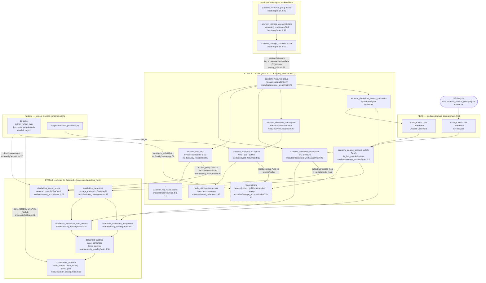

# A4 — STACK E OPERAÇÃO

> Repositório `case-santander-data-master`, branch **`release/segunda-chance-dm`**,
> working tree (commit `f7265c7` + 3 arquivos de documentação sujos).
> Toda afirmação está ancorada em `arquivo:linha`. O que não foi possível
> confirmar por leitura de arquivo está marcado **[NÃO CONFIRMADO]**.
> Nenhum segredo, credencial, token, connection string ou hostname é
> reproduzido — apenas o **tipo** e a **localização**.

---

## 0. RESUMO EXECUTIVO DOS NÚMEROS

| Métrica | Valor |
|---|---|
| Divergências de versão entre arquivos | **12** (8 substantivas + 4 de rigor de pin) |
| Recursos Terraform documentados | **30 blocos** (27 stack principal + 3 bootstrap) → **33 instâncias** no apply |
| Gates de CI **reais** | **11** |
| Etapas/jobs de CI **decorativos ou inertes** | **12** |
| Pontos cegos de observabilidade | **14** |
| Ambientes | 2 (`hk`, `prod`) — isolados por storage account, prefixo de schema e state key; **catálogo e metastore compartilhados** |

---

# 1. STACK — VERSÃO E PROCEDÊNCIA

## 1.1 As sete fontes de versão

| # | Arquivo | O que declara | Papel |
|---|---|---|---|
| 1 | `requirements.txt` | 9 pacotes | Dev local + jobs de CI que rodam `pytest` |
| 2 | `requirements-airflow.txt` | 3 pacotes | Ambiente do scheduler Airflow |
| 3 | `setup.py` | 9 `install_requires` + 24 `console_scripts` | **Runtime do wheel implantado no cluster** |
| 4 | `databricks.yml` | `spark_version`, `node_type_id`, workers | Runtime do job cluster |
| 5 | `terraform/main.tf` + `.terraform.lock.hcl` | 4 providers | Provisionamento Azure/Databricks |
| 6 | `pyproject.toml` | black / ruff / isort / pytest | Ferramentas de qualidade (nenhuma versão pinada) |
| 7 | `.github/workflows/*.yml` (4) + `docker/Dockerfile*` | Python, Terraform, Airflow, provider | Versões efetivas em CI e no container |

## 1.2 Python

| Onde | Valor | Linha |
|---|---|---|
| `setup.py` | `python_requires=">=3.11"` | `setup.py:21` |
| `pyproject.toml` (black) | `target-version = ["py311"]` | `pyproject.toml:3` |
| `pyproject.toml` (ruff) | `target-version = "py311"` | `pyproject.toml:14` |
| `.github/workflows/ci-cd.yml` | `PYTHON_VERSION: '3.11'` | `.github/workflows/ci-cd.yml:11` |
| `.github/workflows/deploy-databricks.yml` | `PYTHON_VERSION: "3.11"` | `.github/workflows/deploy-databricks.yml:29` |
| `.github/workflows/update-airflow-dag.yml` | `PYTHON_VERSION: '3.11'` | `.github/workflows/update-airflow-dag.yml:23` |
| `.github/workflows/test.yml` | `python-version: '3.11'` | `.github/workflows/test.yml:19` |
| `docker/Dockerfile` / `Dockerfile.prod` | `apache/airflow:2.8.0-python3.11` | `docker/Dockerfile:1`, `docker/Dockerfile.prod:1` |

Convergente. A única inconsistência é **textual**: o comentário em
`.github/workflows/update-airflow-dag.yml:145` justifica o pin do Airflow dizendo
"faz backtracking imprevisível **neste job em 3.9**", mas o job roda em 3.11
(`:23,:85`). Comentário defasado — não afeta execução, mas induz erro em quem
mexer no pin.

## 1.3 Runtime de dados (Spark / Delta / Databricks)

| Símbolo | Valor | Arquivo:linha |
|---|---|---|
| `spark_version` (variável do bundle) | `14.3.x-scala2.12` | `databricks.yml:9` |
| `spark_version` no target `hk` | `14.3.x-scala2.12` | `databricks.yml:789` |
| `spark_version` no target `prod` | `14.3.x-scala2.12` | `databricks.yml:811` |
| `node_type_id` (todas as 30 tasks) | `Standard_DS3_v2` | `databricks.yml:57,88,118,148,178,208,241,273,308,330,351,372,393,415,437,459,481,502,523,544,565,586,…` |
| `num_workers` — jobs analíticos | `${var.gold_workers}` → hk **2** / prod **4** | `databricks.yml:58` · `:790` / `:812` |
| `num_workers` — jobs de carga/registro | `${var.sql_workers}` → hk **1** / prod **2** | `databricks.yml:791` / `:813` |
| `azure_attributes` | `SPOT_WITH_FALLBACK_AZURE`, `first_on_demand: 1` | `databricks.yml:60-62` |
| `spark_conf` (só nos 6 jobs `t3_gold_*`) | `spark.databricks.delta.schema.autoMerge.enabled = "true"` | `databricks.yml:62-63` |
| `databricks-connect` | `==14.3.*` | `setup.py:14` |
| `pyspark` (só testes locais) | `==3.5.0` | `requirements.txt:20` |
| `delta-spark` | `>=3.1.0` (runtime) / `==3.1.0` (testes) | `setup.py:17` / `requirements.txt:21` |

O pin `databricks-connect==14.3.*` está **explicitamente justificado** no próprio
arquivo (`setup.py:11-13`): "15.4 nao casa com o cluster (spark_version 14.3.x em
databricks.yml)". Este é o único ponto do repositório onde a versão do cliente é
amarrada à versão do cluster por comentário — e é o pin correto.

## 1.4 `requirements.txt` × `setup.py` — por que declaram conjuntos diferentes

Não é descuido; é a única forma de os dois coexistirem. O motivo está escrito em
`requirements.txt:4-11`:

> `databricks-connect` **ocupa o mesmo namespace de import que `pyspark`** — ele
> não é uma dependência declarada via pip, ele **reescreve os arquivos de
> `pyspark/` dentro do `site-packages`**. Instalar os dois juntos é um conflito
> documentado pela Databricks.

Daí a separação de propósito:

| | `requirements.txt` | `setup.py` (`install_requires`) |
|---|---|---|
| **Alvo** | Máquina de dev e runner do GitHub Actions | Wheel instalado no job cluster |
| **Consumidores** | `ci-cd.yml:36`, `test.yml:23` | `databricks.yml:29-33` (`artifacts.case_santander_wheel`) → `libraries: - whl: ./dist/*.whl` em todas as 30 tasks |
| **Engine Spark** | `pyspark==3.5.0` puro (`requirements.txt:20`) — exigido por `tests/conftest.py:25-30`, que sobe `SparkSession.builder.master("local[1]")` | `databricks-connect==14.3.*` (`setup.py:14`) — cliente remoto usado por `DatabricksSession.builder.getOrCreate()` em cada `jobs/job_*.py` |
| **Entry points** | — | 24 `console_scripts` (`setup.py:25-52`), resolvidos por `python_wheel_task.entry_point`. O comentário `setup.py:22-24` registra que sem esta seção o job falha ao carregar. |
| **Ferramentas de teste** | `pytest==7.4.0` (`:28`) | `pytest>=7.4.0` (`:19`) — **anômalo**: pytest não é dependência de runtime, está sendo empacotado e instalado em todo job cluster |

Consequência prática: **as duas listas nunca são instaladas no mesmo
interpretador**, então uma divergência entre elas não explode em CI — ela só
aparece em produção, no cluster. É exatamente a classe de bug que a §1.5 lista.

## 1.5 DIVERGÊNCIAS DE VERSÃO — 12

### Substantivas (8)

| # | Dependência | Declaração A | Declaração B | Por que dói |
|---|---|---|---|---|
| **D1** | `apache-airflow-providers-databricks` | `==6.0.0` — `requirements-airflow.txt:1` | `==4.7.0` — `docker/Dockerfile:6` **e** `docker/Dockerfile.prod:6` | O container que roda o Airflow (a única execução real) usa **4.7.0**; o arquivo que documenta o ambiente Airflow diz **6.0.0**. `DatabricksSubmitRunOperator` (`dags/dag_pipeline_santander.py:13`) mudou de assinatura entre as majors. Ninguém instala o `requirements-airflow.txt` em lugar nenhum do repositório (`grep -rn "requirements-airflow"` → só o próprio arquivo). |
| **D2** | `apache-airflow-providers-databricks` (3ª versão) | `==4.7.0` / `==6.0.0` acima | **não pinado, resolvido pelo constraints do Airflow 2.7.0** — `.github/workflows/deploy-databricks.yml:255-259` | O CI valida o DAG contra uma 4ª versão, cujo valor exato vem de um arquivo remoto (`constraints-2.7.0`). **[NÃO CONFIRMADO]** — o valor não é determinável a partir do repositório; faltou acesso à rede. O comentário `:247-251` mostra que já houve incidente exatamente aqui. |
| **D3** | `apache-airflow` (core) | `2.8.0` — `docker/Dockerfile:1`, `docker/Dockerfile.prod:1` | `2.7.0` — `.github/workflows/deploy-databricks.yml:252` e `.github/workflows/update-airflow-dag.yml:147` | O DAG é validado em 2.7.0 e executado em 2.8.0. |
| **D4** | `databricks-sdk` | `==0.20.0` — `docker/Dockerfile:7`, `docker/Dockerfile.prod:8` | `>=0.20.0` — `setup.py:15` e `requirements-airflow.txt:2` | `jobs/job_lakehouse_monitoring.py:17` usa `WorkspaceClient.lakehouse_monitors` — API cujo shape mudou entre versões do SDK. No cluster o pin é aberto; no container é fechado em 0.20.0. |
| **D5** | `databricks-connect` | `==14.3.*` — `setup.py:14` | **sem pin** — `.github/workflows/ci-cd.yml:274` (`pip install databricks-connect`) | O job `health-check` instala a versão mais recente e abre `DatabricksSession` (`:281-286`) contra um cluster DBR 14.3. Cliente ≠ DBR é o erro que `setup.py:11-13` documenta ter evitado. |
| **D6** | `databricks-sdk` **ausente** de `requirements.txt` | presente em `setup.py:15` | ausente em `requirements.txt` (9 pacotes, `:14-28`) | `src/config/secrets.py:32` faz `from databricks.sdk.runtime import dbutils`. O CI instala só `requirements.txt` (`ci-cd.yml:36`, `test.yml:23`); qualquer teste que importe esse caminho quebraria por `ModuleNotFoundError`. Hoje não quebra porque nenhum teste chega lá — é uma dívida latente. |
| **D7** | Terraform CLI | `TERRAFORM_VERSION: '1.5'` — `.github/workflows/ci-cd.yml:12` | `required_version = ">= 1.0"` — `terraform/main.tf:16` e `terraform/bootstrap/main.tf:12` | O código aceita 1.0; o CI usa 1.5. Um dev com 1.0 local passa no `validate` e pode gerar plano diferente do CI. |
| **D8** | Providers Terraform | constraints `azurerm ~> 3.0`, `azuread ~> 2.47`, `databricks ~> 1.0`, `random ~> 3.0` — `terraform/main.tf:18-33` | lock `azurerm 3.117.1`, `azuread 2.53.1`, `databricks 1.130.0`, `random 3.9.0` — `terraform/.terraform.lock.hcl:39,19,5,59` | `databricks ~> 1.0` é uma faixa larguíssima (aceita qualquer 1.x). O lock existe e é versionado, mas `terraform/bootstrap/` tem lock **separado** (`terraform/bootstrap/.terraform.lock.hcl`) — dois grafos de provider no mesmo repositório. |

### De rigor de pin (4) — mesmo lower bound, um lado fechado e outro aberto

| # | Dependência | `requirements.txt` | `setup.py` |
|---|---|---|---|
| **D9** | `yfinance` | `==0.2.37` (`:14`) | `>=0.2.37` (`:8`) |
| **D10** | `azure-eventhub` | `==5.15.1` (`:16`) | `>=5.15.1` (`:10`) |
| **D11** | `delta-spark` | `==3.1.0` (`:21`) | `>=3.1.0` (`:17`) |
| **D12** | `pytest` | `==7.4.0` (`:28`) | `>=7.4.0` (`:19`) |

D9 tem consequência direta e já registrada no inventário (§9.1-1): o schema de
`bronze.acoes` vem de `yf.Ticker(...).history(period="2y")`
(`src/ingestion/yahoo_finance.py:50`). O teste roda contra `0.2.37` exato; o
cluster instala a mais recente. **A contagem de campos de `silver.acoes` pode
divergir entre CI e produção sem que nenhum teste perceba** — o
`.option("mergeSchema", "true")` de `src/transformation/silver_acoes.py:69`
absorve a diferença em silêncio.

### O que NÃO é divergência

- `spark_version: 14.3.x-scala2.12` (`databricks.yml:9,789,811`) vs
  `databricks-connect==14.3.*` (`setup.py:14`): **alinhado por construção**, com
  justificativa escrita.
- `pyspark==3.5.0` (`requirements.txt:20`) vs `databricks-connect` (`setup.py:14`):
  separação **deliberada e documentada** (`requirements.txt:4-11`), não divergência.
- Line length 120 em `pyproject.toml:2,13,23` e `ci-cd.yml:45`: consistente.
- `hk` e `prod` usam **a mesma** `spark_version` e o mesmo `node_type_id`; só os
  workers mudam. Homologação testa o mesmo runtime de produção — isso é acerto.

## 1.6 Ferramentas de qualidade (`pyproject.toml`) — nenhuma versão pinada

| Ferramenta | Config | Instalada em CI? |
|---|---|---|
| `black` | `line-length=120`, `py311`, exclui `notebooks` (`pyproject.toml:1-10`) | **Não** — nenhum workflow instala ou roda black |
| `ruff` | `line-length=120`, `select=["E","F","W"]`, `ignore=["E501"]` (`pyproject.toml:12-19`) | **Não** — nenhum workflow instala ou roda ruff |
| `isort` | `profile="black"` (`pyproject.toml:21-23`) | **Não** |
| `flake8` | não configurado em `pyproject.toml`; flags inline | **Sim** — `ci-cd.yml:40,45`, versão **não pinada** |
| `pytest` | `testpaths=["tests"]`, `pythonpath=["."]`, `filterwarnings = error::PytestReturnNotNoneWarning` (`pyproject.toml:25-35`) | **Sim** — `ci-cd.yml:49`, `test.yml:27` |

O linter que roda em CI (**flake8**) é o único não configurado em
`pyproject.toml`; os três configurados nunca rodam. `pytest.ini_options` traz
duas correções reais e documentadas: `testpaths` impede a coleta dos scripts de
diagnóstico que fariam chamadas de rede (`pyproject.toml:26-29`) e
`error::PytestReturnNotNoneWarning` transforma teste-que-retorna-valor em erro
(`:32-34`).

---

# 2. INFRAESTRUTURA (`terraform/`)

## 2.1 Inventário de recursos — 30 blocos / 33 instâncias

### Stack principal (`terraform/`) — 27 blocos, 30 instâncias

| # | Recurso | Bloco | Instâncias | Função no pipeline |
|---|---|---|---|---|
| 1 | `azurerm_databricks_access_connector.unity_catalog` | `terraform/main.tf:84-93` | 1 | Identidade gerenciada (SystemAssigned, `:90-92`) que o **metastore** usa para acessar o `storage_root`. `main.tf:82-83`: "Sem ela, toda tabela gerenciada (`saveAsTable`) falha" |
| 2 | `azurerm_resource_group.this` | `terraform/modules/resource_group/main.tf:3-7` | 1 | Contêiner de tudo; `rg-case-santander-<env>` (`environments/hk.tfvars:3`, `prod.tfvars:3`) |
| 3 | `azurerm_storage_account.this` | `terraform/modules/storage_account/main.tf:3-17` | 1 | **ADLS Gen2** — lakehouse inteiro. `Standard`/`LRS`/`Hot` (`:7-9`) |
| 4-8 | `azurerm_storage_container.{bronze,silver,gold,checkpoints,catalog}` | `modules/storage_account/main.tf:19,25,31,37,43` | 5 | Camadas medallion + `catalog` (storage_root do metastore) + `checkpoints` |
| 9 | `azurerm_role_assignment.blob_contributor` (`for_each`) | `modules/storage_account/main.tf:53-59` | **2** | RBAC de **dado** — ver §2.5 |
| 10 | `azurerm_key_vault.this` | `terraform/modules/key_vault/main.tf:3-48` | 1 | Cofre dos 7 secrets; 2 `access_policy` inline (`:14-33`, `:37-45`) |
| 11 | `azurerm_eventhub_namespace.this` | `terraform/modules/event_hub/main.tf:3-11` | 1 | Namespace `Standard`, capacity 1 (`:7-8`) |
| 12 | `azurerm_eventhub.this` | `modules/event_hub/main.tf:13-44` | 1 | Hub + **Capture** (`:30-43`) — ver §2.4 |
| 13 | `azurerm_eventhub_authorization_rule.this` | `modules/event_hub/main.tf:46-54` | 1 | Regra `pipeline-access`, listen+send+manage (`:51-53`) |
| 14 | `azurerm_databricks_workspace.this` | `terraform/modules/databricks_workspace/main.tf:3-15` | 1 | Workspace `premium` (`variables.tf:25`), `no_public_ip = false` (`:11`) |
| 15 | `databricks_secret_scope.this` | `terraform/modules/secret_scope/main.tf:23-33` | 1 (via `count`, `main.tf:186`) | Scope Key Vault-backed consumido por `dbutils.secrets.get` |
| 16-22 | `azurerm_key_vault_secret.*` (7 blocos) | `terraform/modules/secrets/main.tf:3,9,15,21,27,33,39` | 7 | Os 7 secrets lidos por `src/config/secrets.py:32-37` |
| 23 | `databricks_metastore.this` | `terraform/modules/unity_catalog/main.tf:18-26` | 1 (via `count`, `:19`) | Metastore Unity Catalog, `storage_root` no container `catalog` (`:23`) |
| 24 | `databricks_metastore_data_access.this` | `modules/unity_catalog/main.tf:35-45` | 1 | Credencial do metastore → Access Connector (`:42-44`), `is_default = true` (`:40`) |
| 25 | `databricks_metastore_assignment.this` | `modules/unity_catalog/main.tf:47-52` | 1 | Liga metastore ↔ workspace pelo **ID numérico** do control plane (`:51`) |
| 26 | `databricks_catalog.this` | `modules/unity_catalog/main.tf:54-64` | 1 | Catálogo `case_santander`, `force_destroy = true` (`:63`) |
| 27 | `databricks_schema.layers` (`for_each`) | `modules/unity_catalog/main.tf:68-78` | **3** | `<env>_bronze`, `<env>_silver`, `<env>_gold` (`:73`) |

**Data sources (3):** `azurerm_client_config.current` (`main.tf:68`) —
tenant/object da identidade que roda o Terraform; `azuread_service_principal.databricks`
(`:72-74`) — o SP global "AzureDatabricks", cujo `client_id` é fixo em todos os
tenants (`:70-71`); `azuread_service_principal.jobs` (`:78-80`) — resolve o
**object id** do SP dos jobs a partir do application id, porque
"role assignment exige o object id" (`:77`).

### Bootstrap (`terraform/bootstrap/`) — 3 blocos, 3 instâncias

| # | Recurso | Linha | Função |
|---|---|---|---|
| 28 | `azurerm_resource_group.tfstate` | `terraform/bootstrap/main.tf:25-28` | RG do backend remoto |
| 29 | `azurerm_storage_account.tfstate` | `bootstrap/main.tf:30-49` | Storage do state. `allow_nested_items_to_be_public = false` (`:39`), `min_tls_version = TLS1_2` (`:40`), `versioning_enabled` + retenção 30 dias (`:42-48`) — porque "State contem secrets" (`:37-38`) |
| 30 | `azurerm_storage_container.tfstate` | `bootstrap/main.tf:51-55` | Container `tfstate`, privado |

O bootstrap usa **backend local** (`bootstrap/main.tf:5-6`) — o seu próprio state
fica em `bootstrap/terraform.tfstate`, e `terraform/.gitignore:2` ignora
`*.tfstate`. Ou seja: **o state do backend não está versionado nem remoto**.
Perdê-lo significa perder o rastro do storage que guarda todos os outros states.

## 2.2 ADLS Gen2 e o `is_hns_enabled`

```hcl
# terraform/modules/storage_account/main.tf:11-14
# Obrigatorio para ADLS Gen2 / Unity Catalog e para rename atomico de
# diretorio (commit protocol do Structured Streaming + Delta).
# ATENCAO: alterar este atributo forca recriacao da storage account.
is_hns_enabled = true
```

Três razões, todas verificáveis no código:

1. **`abfss://` exige HNS.** Todo path do pipeline é `abfss://` — 12 paths reais
   (INVENTÁRIO §4.2), montados em `src/config/environment.py:129-146` e
   `src/config/settings.py:20-32`. Sem hierarchical namespace o driver `abfs` cai
   em Blob flat e `abfss://` não resolve.
2. **Rename atômico de diretório.** O commit protocol do Delta e do Structured
   Streaming depende de `rename` atômico. O checkpoint em
   `jobs/job_streaming_continuous.py:53` e o `_delta_log` de todas as tabelas
   externas dependem disso. Em Blob flat, `rename` é copy+delete — não atômico —
   e duas escritas concorrentes corrompem o log.
3. **Unity Catalog.** O `storage_root` do metastore é
   `abfss://catalog@…dfs.core.windows.net/`
   (`terraform/modules/unity_catalog/main.tf:23`). Metastore UC no Azure exige
   ADLS Gen2.

O aviso de recriação (`:13`) é o que importa em operação: mudar esse flag
**destrói e recria a storage account**, ou seja, apaga o lakehouse inteiro.

**Ponto morto:** o container `checkpoints`
(`modules/storage_account/main.tf:37-41`) **não é usado por nenhum código**. Os
checkpoints reais vivem dentro do container `silver`:
`abfss://silver@…/checkpoints/streaming_continuous/`
(`jobs/job_streaming_continuous.py:53`) e
`abfss://silver@…/checkpoints/streaming/` (`jobs/job_streaming.py:43`).
`grep -rn "checkpoints@" --include=*.py` → **zero ocorrências**. Recurso órfão.

## 2.3 Key Vault + secret scope

**Cadeia completa, ponta a ponta:**

```
terraform/modules/secrets/main.tf:3-44        grava 7 secrets no Key Vault
        ↓
terraform/modules/key_vault/main.tf:37-45     access_policy dá Get/List ao SP "AzureDatabricks"
        ↓
terraform/modules/secret_scope/main.tf:23-33  cria o scope Key Vault-backed
        ↓  scope_name = module.key_vault.key_vault_name   (terraform/main.tf:194)
src/config/environment.py:79                  config["key_vault"] = kv-case-santander-<env>
        ↓
src/config/secrets.py:34-37                   dbutils.secrets.get(scope=key_vault, key=…)
        ↓
src/config/settings.py:36-48                  configure_adls() → OAuth client-credentials no Spark
```

Os 7 secrets (nomes apenas — os valores vivem só no Key Vault):
`client-id`, `client-secret`, `tenant-id`, `storage-account`, `kaggle-username`,
`kaggle-key`, `salt` — declarados em `terraform/main.tf:171-179` e criados um a um
em `terraform/modules/secrets/main.tf:3,9,15,21,27,33,39`. Lidos em
`src/config/settings.py:62-68` e `src/config/secrets.py:40-72`. O `salt` tem
`count = var.include_salt ? 1 : 0` (`modules/secrets/variables.tf:12-15`,
`main.tf:43`) — o único condicional do módulo; o comentário em
`terraform/terraform.tfvars.example:37` avisa que trocá-lo **invalida todos os
hashes já gravados** (é a chave da anonimização de `src/security/hashing.py`).

**Duas permissões distintas, frequentemente confundidas** — e o repositório
documenta a distinção em `modules/storage_account/main.tf:49-52`:

| Permissão | O que libera | Onde |
|---|---|---|
| `access_policy` do Key Vault (`Get`,`List` de secret) | Ler o **segredo** | `modules/key_vault/main.tf:41-44` |
| `Storage Blob Data Contributor` | Ler/escrever o **dado** | `modules/storage_account/main.tf:53-59` |

Sem a segunda, "o service principal autentica no AAD mas nao tem autorizacao no
dado: todo `spark.read/write` em `abfss://` retorna 403
`AuthorizationPermissionMismatch`" (`modules/storage_account/main.tf:49-51`).

**Limitação do Azure, documentada em três lugares** (`modules/secret_scope/main.tf:7-12`,
`terraform/variables.tf:106`, `terraform/terraform.tfvars.example:20-21`): scope
Key Vault-backed **só pode ser criado com credencial de usuário AAD**, não de
service principal. Por isso `var.create_secret_scope` (`variables.tf:105-109`,
default `true`) e o `count` em `terraform/main.tf:186`. Quando desligado, o
output `databricks_secret_scope` degrada para o nome do Key Vault
(`terraform/outputs.tf:71`) — o nome que o código espera de qualquer forma.

## 2.4 Event Hub + Capture — a origem da cadeia de streaming

```hcl
# terraform/modules/event_hub/main.tf:20-24
# ORIGEM DA CADEIA DE STREAMING.
# Sem Capture, ninguem escrevia em bronze/kafka/: os produtores mandam
# para o Event Hub e os jobs leem do ADLS com Auto Loader. O elo nao
# existia -- toda a cadeia streaming -> silver -> 4 tabelas gold nunca
# recebia um registro.
```

| Atributo | Valor | Linha |
|---|---|---|
| Namespace | `evhcasesantander-<env>`, sku `Standard`, capacity 1 | `modules/event_hub/main.tf:4,7,8` |
| Event Hub | `transacoes-financeiras-<env>` | `:14` |
| `message_retention` | 7 dias | `:17` |
| `partition_count` | 2 | `:18` |
| Capture: encoding | **Avro** (único formato suportado) | `:32` |
| Capture: gatilho | 60 s **ou** 10 MiB (10485760 B) | `:33-34` |
| Capture: `skip_empty_archives` | `true` | `:35` |
| Capture: destino | container `bronze` (`terraform/main.tf:163`), path `kafka/{Namespace}/{EventHub}/{PartitionId}/{Year}/{Month}/{Day}/{Hour}/{Minute}/{Second}` | `:39-40` |

O envelope Avro (`{SequenceNumber, Offset, EnqueuedTimeUtc, SystemProperties,
Properties, Body}`, documentado em `:26-29`) é decodificado em
`jobs/job_streaming_continuous.py:83-85`, que lê o campo `Body`.

**Ninguém consome o Event Hub diretamente.** O caminho é sempre
`produtor → Event Hub → Capture → ADLS bronze/kafka/ → Auto Loader`
(`jobs/job_streaming_continuous.py:51,73-78`). Consequência de latência: o
Capture só fecha um arquivo a cada 60 s (`:33`), e o job de gold roda a cada
5 min (`databricks.yml:282`) — o "tempo real" da arquitetura tem piso de ~1 min
antes de qualquer processamento.

## 2.5 RBAC — 2 role assignments, ambos essenciais

```hcl
# terraform/main.tf:119-122
data_contributor_principal_ids = {
  jobs_sp       = data.azuread_service_principal.jobs.object_id
  unity_catalog = azurerm_databricks_access_connector.unity_catalog.identity[0].principal_id
}
```

Expandidos em `modules/storage_account/main.tf:53-59` (`for_each`), ambos com
`Storage Blob Data Contributor` no escopo da **storage account inteira**:

| Principal | Para quê | Quem usa |
|---|---|---|
| SP dos jobs (`var.client_id` → object id via `main.tf:78-80`) | Ler/escrever `abfss://` a partir do Spark | `configure_adls()` — `src/config/settings.py:36-48`, chamado em `jobs/job_streaming_continuous.py:49` |
| Access Connector (managed identity) | Metastore UC acessar o `storage_root` e as tabelas gerenciadas | `databricks_metastore_data_access` — `modules/unity_catalog/main.tf:42-44` |

Além disso, 3 `access_policy` de Key Vault (2 blocos inline em
`modules/key_vault/main.tf:14-33` e `:37-45`) e a regra de autorização do
Event Hub (`modules/event_hub/main.tf:46-54`, `listen`+`send`+`manage`).

**Observações de superfície de permissão:**
- O escopo do `Storage Blob Data Contributor` é a **conta inteira**
  (`main.tf:56` → `azurerm_storage_account.this.id`), não por container. Um job
  bronze pode sobrescrever gold.
- A regra `pipeline-access` do Event Hub concede **`manage = true`**
  (`modules/event_hub/main.tf:53`) além de listen/send. Os produtores
  (`scripts/eventhub_producer.py:86-98`) só precisam de `send`.
- O `object_id` do operador humano recebe `Create`/`Delete`/`Recover` de chave e
  `Set`/`Delete`/`Recover` de secret (`modules/key_vault/main.tf:18-32`).
- `purge_protection_enabled = false` e `soft_delete_retention_days = 7`
  (`modules/key_vault/main.tf:10-11`) — deliberado, para permitir ciclos de
  subir/derrubar, mas significa que um `destroy` acidental é recuperável por
  apenas 7 dias.

## 2.6 Unity Catalog — o encadeamento que faz `saveAsTable` funcionar

Ordem obrigatória, explicitada por `depends_on` em `modules/unity_catalog/main.tf:56`:

```
databricks_metastore (:18)           account-level, storage_root = abfss://catalog@…
        │  Azure permite UM metastore por região/account (:16-17)
        ├── databricks_metastore_data_access (:35)   credencial → Access Connector
        ├── databricks_metastore_assignment (:47)    metastore ↔ workspace_id numérico
        │                                             (databricks_workspace/outputs.tf:11-13:
        │                                              "sao dois IDs diferentes")
        └── databricks_catalog (:54)   name = case_santander, force_destroy
                └── databricks_schema.layers (:68)   for_each {bronze,silver,gold}
                                                     name = "${schema_prefix}${each.key}"
```

`force_destroy = true` no catálogo (`:63`) e nos schemas (`:77`) existe porque
"Unity Catalog recusa apagar catalog nao vazio" (`:60-62`) — necessário para
ciclos automatizados. Em produção isso é uma faca: um `terraform destroy` apaga
metadados com dado dentro, sem resistência.

O `existing_metastore_id` (`terraform/variables.tf:43-47`,
`modules/unity_catalog/variables.tf:31-35`) é o escape para a restrição
"um metastore por região/account" — ver §3.3.

## 2.7 Diagrama da arquitetura de infraestrutura



`*` o container `checkpoints` é criado mas nunca usado (§2.2).

---

# 3. AMBIENTES — `hk` e `prod`

## 3.1 As quatro camadas de isolamento

| # | Camada | `hk` | `prod` | Onde |
|---|---|---|---|---|
| 1 | **Resource group** | `rg-case-santander-hk` | `rg-case-santander-prod` | `terraform/environments/hk.tfvars:3` / `prod.tfvars:3` |
| 2 | **Storage account** (dado) | `stcasesantanderhk` | `stcasesantanderprod` | TF: `modules/storage_account/main.tf:4` + `variables.tf:19`; Python: `src/config/environment.py:78` |
| 3 | **Key Vault / secret scope** | `kv-case-santander-hk` | `kv-case-santander-prod` | TF: `modules/key_vault/main.tf:4` + `variables.tf:19`; Python: `src/config/environment.py:79` |
| 4 | **Event Hub** | `evhcasesantander-hk` / `transacoes-financeiras-hk` | `…-prod` | TF: `modules/event_hub/main.tf:4,14`; Python: `src/config/environment.py:80-81` |
| 5 | **Prefixo de schema** (metadado) | `hk_` | `prod_` | TF: `terraform/main.tf:96` (`local.schema_prefix`) → `modules/unity_catalog/main.tf:73`; Python: `src/config/environment.py:88,103` → `src/config/tables.py:31,34-36` |
| 6 | **Workspace Databricks** | `databricks-santanderhk` | `databricks-santanderprod` | `modules/databricks_workspace/main.tf:4` + `variables.tf:19` |
| 7 | **State Terraform** | `case-santander-data-hk.tfstate` | `case-santander-data-prod.tfstate` | `scripts/deploy_infra.sh:29`, `scripts/destroy_infra.sh:33`, `.github/workflows/ci-cd.yml:205,242` |
| 8 | **Root path do bundle** | `/Workspace/Shared/bundles/case-santander-hk` | `…-prod` | `databricks.yml:796` / `:818` |
| 9 | **Host do workspace** | `${env.DATABRICKS_HOST_HK}` | `${env.DATABRICKS_HOST_PROD}` | `databricks.yml:795` / `:817` |

**A convenção de nomes é derivada duas vezes, independentemente** — uma no
Terraform, outra em Python — e o repositório reconhece o risco:
`src/config/environment.py:65-66` diz "Nomenclatura derivada da MESMA convencao
do Terraform (terraform/modules/*). Confira com: `terraform output resource_names`",
e `terraform/outputs.tf:79-91` existe exatamente para essa conferência
(`resource_names` devolve storage/kv/eventhub/catalog/schema_prefix). É uma
mitigação por convenção, não por contrato: **nada falha se divergirem**.

Cada nome aceita override por variável de ambiente
(`STORAGE_ACCOUNT`, `KEY_VAULT_NAME`, `EVENTHUB_NAMESPACE`, `EVENTHUB_NAME` —
`src/config/environment.py:78-81`), documentado em `:75-76`.

## 3.2 O que **difere** de comportamento entre os ambientes

| Parâmetro | `hk` | `prod` | Linha | **É lido por algum código?** |
|---|---|---|---|---|
| `gold_workers` | 2 | 4 | `databricks.yml:790` / `:812` | Sim — `num_workers` das tasks |
| `sql_workers` | 1 | 2 | `:791` / `:813` | Sim — 3 tasks (`:725,748,769`) |
| `mode` do target | `development` | `production` | `:787` / `:809` | Sim — comportamento da CLI |
| `pause_status` de `streaming_to_gold_continuous` | `PAUSED` | `UNPAUSED` | `:801-806` / `:284` | Sim |
| `enable_streaming` (bundle) | `false` | `true` | `:793` / `:815` | **NÃO** — ver §4.4 |
| `api_rate_limit` (4 APIs) | 15/45/90/5 | 30/120/300/20 | `src/config/environment.py:90-95` / `:105-110` | Sim — `src/ingestion/api_wrapper.py` |
| `is_production` | `False` | `True` | `:98` / `:113` | Sim — `api_wrapper.py:97`, `bcb.py:36`, `world_bank.py:34`, `yahoo_finance.py:39` (só para imprimir aviso) |
| `data_retention_days` | 30 | 90 | `:96` / `:111` | **NÃO** — nenhum call site |
| `enable_streaming` (Python) | `False` | `True` | `:97` / `:112` | **NÃO** — nenhum call site |

Verificação: `grep -rn "enable_streaming\|data_retention_days" src/ jobs/ scripts/ dags/ tests/ config/`
retorna **apenas as definições** em `src/config/environment.py:96-97,111-112`.

## 3.3 ONDE O ISOLAMENTO É FRÁGIL — 8 pontos

### F1 — Catálogo e **metastore** compartilhados entre os dois ambientes

```python
# src/config/environment.py:87 e :102
"catalog": "case_santander",  # Mesmo catalog, schemas separados
```

```hcl
# terraform/environments/hk.tfvars:19  e  prod.tfvars:19
unity_catalog_name = "case_santander"
```

E os dois `.tfvars` usam **a mesma região**: `location = "eastus2"`
(`hk.tfvars:4`, `prod.tfvars:4`). Combinado com
`modules/unity_catalog/main.tf:16-17` ("Azure permite apenas UM metastore por
regiao por account") e `main.tf:22` (`name = var.catalog_name`), o segundo
`terraform apply` na mesma região tentaria criar um metastore homônimo. O escape
existe (`existing_metastore_id`, `terraform/variables.tf:43-47`) mas **os dois
`.tfvars` versionados deixam a variável comentada** (`hk.tfvars:21-25`,
`prod.tfvars:21-25` só listam o que preencher, e `existing_metastore_id` não está
na lista). Quem sobe `prod` depois de `hk` precisa saber disso por fora do
repositório.

O mesmo vale para `databricks_catalog.this` (`modules/unity_catalog/main.tf:54-64`):
dois states, um único nome `case_santander`. O segundo apply encontra o catálogo
já criado — e como Terraform não faz import automático, dá conflito.

### F2 — O `destroy` de um ambiente pode derrubar o outro

`scripts/destroy_infra.sh:21-27` documenta isso com precisão:

> "Azure permite UM metastore Unity Catalog por regiao/account. Se voce apontou um
> segundo ambiente para o metastore deste com `existing_metastore_id`, derrubar
> ESTE ambiente derruba o metastore que o outro depende. **Terraform nao ve essa
> dependencia (estados diferentes)**."

Com `force_destroy = true` no catálogo (`modules/unity_catalog/main.tf:63`) e nos
schemas (`:77`), a destruição não encontra resistência mesmo com dado dentro.

### F3 — O `key` do backend é fixo no código; o isolamento vive só nos scripts

```hcl
# terraform/main.tf:36-41
backend "azurerm" {
  ...
  key = "case-santander-data.tfstate"   # SEM sufixo de ambiente
}
```

`scripts/deploy_infra.sh:25-27` explica: "O bloco `backend` de main.tf tem `key`
fixo e nao aceita variaveis; sem este `-backend-config`, hk e prod compartilham o
mesmo state e **aplicar um planeja destruir o outro**." O sufixo é injetado em
`deploy_infra.sh:29` e `destroy_infra.sh:33`, e nos workflows em
`.github/workflows/ci-cd.yml:205,242`.

**Mas o caminho manual documentado não injeta.** `terraform/README.md:112` manda
rodar `terraform init` **sem** `-backend-config`. Quem seguir o README manual usa
a key fixa `case-santander-data.tfstate` e escreve por cima do state do outro
ambiente.

### F4 — `deploy_infra.sh stage2` não roda `init` com a key do ambiente

`cmd_stage1` (`scripts/deploy_infra.sh:52`) e ambos os comandos de
`destroy_infra.sh` (`:47,:62`) chamam
`terraform init -backend-config="key=$BACKEND_KEY"`. **`cmd_stage2`
(`deploy_infra.sh:59-65`) não chama `init` de forma alguma** — vai direto ao
`terraform apply` (`:62`). Funciona quando é chamado logo após `stage1` no mesmo
diretório (`.terraform/` já inicializado); em shell novo, clone novo, ou runner
de CI efêmero, usa o backend que estiver em `.terraform/` — ou a key fixa. É o
mesmo modo de falha do F3, por outro caminho.

### F5 — Sem `ENVIRONMENT`, todo job cai em `hk` silenciosamente

```python
# src/config/environment.py:54
env = os.getenv("ENVIRONMENT", "hk").lower()
```

O default é `hk`, não uma exceção. O bundle injeta `spark_env_vars.ENVIRONMENT`
em todas as 30 tasks (`databricks.yml:64-65` e homólogos), então o caminho normal
está coberto. Mas qualquer execução fora do bundle — notebook, `databricks bundle
run` de um job avulso mal configurado, execução manual, o DAG Airflow (que lê
`ENVIRONMENT` em `dags/dag_pipeline_santander.py:19`, também com default `hk`) —
escreve em `hk_*` sem erro. Como o catálogo é o mesmo (F1), a escrita **é
aceita**: não há barreira de permissão entre `hk_gold` e `prod_gold`.

### F6 — A trava de produção existe e nunca é acionada

`EnvironmentConfig.validate_environment` (`src/config/environment.py:159-177`)
exige `CONFIRM_PRODUCTION=true` para prosseguir em produção (`:171-175`).
`grep -rn "validate_environment"` retorna **apenas a definição**. Nenhum job, nenhum
script, nenhum workflow a chama. A variável `CONFIRM_PRODUCTION` está declarada em
`.env.example` mas não tem consumidor efetivo.

### F7 — `.env.example` declara 16 variáveis que nenhum código lê

Cruzando `.env.example` com o resultado de
`grep -rhoE "os\.(getenv|environ)\(['\"][A-Z_0-9]+" src/ jobs/ scripts/ dags/ config/ tests/`:

| Declarada em `.env.example` | Lida pelo código? |
|---|---|
| `ENVIRONMENT`, `DATABRICKS_HOST_HK`, `DATABRICKS_HOST_PROD`, `DATABRICKS_REPO_PATH`, `CONFIRM_PRODUCTION`, `KAGGLE_API_TOKEN` | **Sim** |
| `STORAGE_ACCOUNT_HK` / `_PROD` | Não — o código lê `STORAGE_ACCOUNT` (`environment.py:78`) |
| `KEY_VAULT_HK` / `_PROD` | Não — o código lê `KEY_VAULT_NAME` (`:79`) |
| `EVENTHUB_NS_HK` / `_PROD` | Não — o código lê `EVENTHUB_NAMESPACE` (`:80`) |
| `DATA_RETENTION_HK` / `_PROD`, `ENABLE_STREAMING_HK` / `_PROD` | Não — valores são constantes em `environment.py:96-97,111-112` |
| `DATABRICKS_TOKEN_HK` / `_PROD`, `DATABRICKS_CLUSTER_ID_HK` / `_PROD` | Não — o código lê `DATABRICKS_CLUSTER_ID` (`dags/dag_pipeline_santander.py:17`) |
| `SQL_SERVER_HK` / `_PROD` | Não — **não existe SQL Server em lugar nenhum do repositório** |
| `API_RATE_LIMIT_*_HK` / `_PROD` (8 variáveis) | Não — valores fixos em `environment.py:90-95,105-110` |

Quem preencher o `.env` acreditando estar parametrizando o ambiente está
configurando 16 variáveis inertes — e o override que **de fato** funciona
(`STORAGE_ACCOUNT`, `KEY_VAULT_NAME`, `EVENTHUB_NAMESPACE`, `EVENTHUB_NAME`,
`REPO_PATH`) não está no `.env.example`.

### F8 — Fallback de path com identidade pessoal

`src/config/environment.py:31-32`: quando `REPO_PATH` não está setado e o código
roda dentro do Databricks, o path do Workspace cai num caminho fixo que embute o
e-mail de um usuário individual. Não é segredo, mas é um acoplamento de ambiente
a uma pessoa — em `prod` isso quebra assim que a conta sair.

## 3.4 O isolamento que **funciona bem**

- **Dado**: storage accounts distintas, sem cruzamento possível
  (`environment.py:78`, `modules/storage_account/main.tf:4`).
- **Segredo**: Key Vaults distintos, scopes distintos
  (`environment.py:79`, `modules/key_vault/main.tf:4`).
- **Fila**: Event Hubs distintos (`environment.py:80-81`).
- **Metadado**: `src/config/tables.py:4-9` documenta que **antes** havia
  219 referências hardcoded a `case_santander.bronze/silver/gold` ignorando o
  prefixo — "hk e prod escreviam nas MESMAS tabelas, enquanto os paths ADLS eram
  isolados por storage account. Metadados compartilhados apontando para dados de
  storages diferentes é a pior combinação possível". Isso foi corrigido: hoje
  todo FQN passa por `SCHEMA_BRONZE/SILVER/GOLD` (`tables.py:34-36`).

O resíduo é o catálogo comum (F1) — um nível acima do que a refatoração resolveu.

---

# 4. ORQUESTRAÇÃO

## 4.1 Quem manda: `databricks.yml`

Não há Control-M. A fonte da ordem de execução é **Databricks Asset Bundles**:
`databricks.yml` (27.193 bytes, 818 linhas), com `bundle.name = case-santander-data`,
version `1.0.0` (`databricks.yml:1-4`).

- **9 jobs** em `resources.jobs` (`:39,:70,:100,:130,:160,:190,:221,:253,:287`)
- **30 tasks** no total; **22** dentro de `pipeline_completo` (`:287`)
- **2 agendados**: `pipeline_completo` (`0 0 6 * * ?`, `:780`) e
  `streaming_to_gold_continuous` (`0 */5 * * * ?`, `:282`)
- **1 artefato**: wheel construído por `python setup.py bdist_wheel`
  (`:29-33`), anexado a todas as tasks via `libraries: - whl: ./dist/*.whl`
- **Cada task levanta job cluster próprio** (`new_cluster`) — não há pool,
  não há `max_concurrent_runs`

## 4.2 Schedules e `pause_status` por target

| Job | `quartz_cron_expression` | `timezone_id` | `pause_status` base | Override por target |
|---|---|---|---|---|
| `pipeline_completo` | `0 0 6 * * ?` (06:00 diário) | `America/Sao_Paulo` | `UNPAUSED` (`databricks.yml:782`) | **nenhum** |
| `streaming_to_gold_continuous` | `0 */5 * * * ?` (5 em 5 min) | `America/Sao_Paulo` | `UNPAUSED` (`:284`) | `hk` → **`PAUSED`** (`:801-806`) |
| `streaming_continuous` | — | — | sem schedule (`:249`: "serviço contínuo") | — |
| 6 × `t3_gold_*` | — | — | sem schedule (`:36-37`) | — |

O bloco de schedule de `pipeline_completo` carrega uma cicatriz documentada
(`databricks.yml:776-778`):

> "precisa ficar aninhado em `pipeline_completo` — com 4 espaços virava um **job
> fantasma chamado "schedule"** e o pipeline era implantado sem agendamento"

O override de `hk` também tem justificativa escrita (`:797-800`):

> "Homologacao nao roda streaming (`enable_streaming: false`). O override abaixo
> torna isso explicito: antes, o unico freio era o efeito colateral de
> `mode: development` pausar schedules, que desapareceria se este target virasse
> `mode: production`."

**Consequência não resolvida:** o mesmo raciocínio não foi aplicado a
`pipeline_completo`. Em `hk`, `mode: development` (`:787`) pausa os schedules como
efeito colateral da CLI — `pipeline_completo` não tem override explícito, então
seu estado efetivo em `hk` **depende do comportamento da CLI, não do arquivo**.
**[NÃO CONFIRMADO]** — o comportamento exato de `mode: development` da versão da
CLI usada não é determinável pelo repositório (`databricks/setup-cli@main`,
`ci-cd.yml:78`, instala a versão mais recente, sem pin).

## 4.3 O DAG Airflow — espelho gerado, não segunda fonte

`dags/dag_pipeline_santander.py` traz no cabeçalho (`:1-7`):

> "Gerado automaticamente via `scripts/sync_airflow_from_databricks.py`
> — **NÃO EDITE MANUALMENTE** — Alterações devem ser feitas em `databricks.yml`"

E repete no rodapé (`:208-211`).

**Estrutura idêntica ao bundle:** 22 tasks, 22 arestas (`:186-206`), mesmo cron
(`0 6 * * *`, `:47`), `catchup=False` (`:49`), `retries=2` /
`retry_delay=5min` (`:23-24`). O gerador tira o caminho do job **do próprio
`entry_point`** (`scripts/sync_airflow_from_databricks.py:243-249`), e o comentário
ali explica por quê:

> "O mapeamento hardcoded (`_map_task_to_job_path`) tinha duas falhas: ignorava o
> valor real de `entry_point` … e nao conhecia `task_keys` novas — **uma task
> adicionada ao bundle desaparecia do DAG em silencio, sem erro**."

**Mas o modelo de execução diverge em dois eixos** (INVENTÁRIO §9.3-6,7):

| | `databricks.yml` | `dags/dag_pipeline_santander.py` |
|---|---|---|
| Compute | `new_cluster` — job cluster por task (`:56-65` e 29 homólogos) | `existing_cluster_id` — cluster fixo (`:35`), com um ID **hardcoded como default** (`:17`) |
| Task type | `python_wheel_task` + `entry_point` (`:49-52` etc.) | `spark_python_task` → `{REPO_PATH}/jobs/*.py` (`:36-38`) |
| Instalação de `src/` | wheel (`libraries: - whl`) | repo sincronizado no Workspace (`REPO_PATH`, `:18`) |

Ou seja: **o mesmo grafo, executado de duas maneiras incompatíveis**. Rodar pelo
Airflow exige um cluster interativo vivo e o repositório sincronizado no
Workspace; rodar pelo bundle exige o wheel. As duas rotas não são intercambiáveis,
e o gerador não tem como reconciliá-las — a diferença está no template do
gerador (`sync_airflow_from_databricks.py:181-192`), não no `databricks.yml`.

## 4.4 A flag `enable_streaming` — declarada quatro vezes, lida zero

| Local | Declaração |
|---|---|
| `databricks.yml:23-25` | variável do bundle, default `false` |
| `databricks.yml:793` | target `hk` → `false` |
| `databricks.yml:815` | target `prod` → `true` |
| `src/config/environment.py:97` | config `hk` → `False` |
| `src/config/environment.py:112` | config `prod` → `True` |

Referências de **uso**: nenhuma. A única menção fora das declarações é um
**comentário**: `databricks.yml:250` — `# Condicionado à variável enable_streaming`
— logo abaixo do bloco de `streaming_continuous`, que não tem `condition_task`,
não tem `if`, não tem `count`, não tem nada que a consuma. Asset Bundles não
suportam `count`/`for_each` sobre um job; a condicional teria que ser um
`condition_task` ou uma `run_if`, e nenhum existe no arquivo.

Do lado Python, `grep -rn "enable_streaming" src/ jobs/ scripts/ dags/ tests/ config/`
→ só `environment.py:97,112`.

**Efeito real:**
- `streaming_continuous` é implantado nos **dois** ambientes, idêntico.
- Ele não tem schedule (`:249`) — é um serviço 24/7 que **alguém precisa iniciar
  à mão**. Não é `enable_streaming` que o impede de rodar em `hk`: é a ausência de
  schedule.
- O único freio efetivo em `hk` é o `pause_status: PAUSED` de
  `streaming_to_gold_continuous` (`:801-806`), aplicado a um job **diferente**.
- Consequência em cadeia (INVENTÁRIO §9.4-1): `silver.streaming` não é alimentada
  automaticamente em nenhum ambiente, e as 4 gold de streaming dependem dela.

`enable_streaming` é **documentação executável que não executa**. Quem lê o bundle
conclui que homologação não sobe streaming por design; o que realmente acontece é
que ninguém sobe em lugar nenhum, por omissão.

## 4.5 O que implica editar o DAG à mão

Três consequências concretas, todas verificáveis:

1. **O CI reprova o PR.** `.github/workflows/deploy-databricks.yml:292-299`
   regenera o DAG e roda:
   ```bash
   if git diff --name-only | grep -q "dags/dag_pipeline_santander.py"; then
     ... ; exit 1
   fi
   ```
   Qualquer edição manual que o gerador não reproduza faz o job falhar. **Este é o
   gate mais forte do repositório.**

2. **A próxima regeração apaga a edição.** `generate_dag` abre o arquivo em modo
   `'w'` (`scripts/sync_airflow_from_databricks.py:330`) — sobrescrita total, sem
   merge. E `main()` regenera **sempre** que `--generate` é passado
   (`:428-430`), e ainda regenera automaticamente quando a validação falha
   (`:424-426`).

3. **A validação de consistência é frouxa e não reprova sozinha.** `validate_consistency`
   (`:338-382`) compara apenas: presença do marcador de sincronização (`:351-356`),
   presença de `>>` (`:363`) e a **contagem** de `databricks_task(`
   (`:372-379`) — o próprio código admite: "Comparar (simplificado - **verifica
   apenas número de tasks**)" (`:371`). Trocar o `entry_point` de uma task por
   outro, ou inverter duas arestas, passa nessa validação. E `main()` **nunca sai
   com código diferente de zero**: quando inconsistente, ele só regenera
   (`:424-426`) e imprime `[SUCCESS]` (`:431`). O que reprova é o `git diff` do
   passo seguinte no workflow, não o script.

**Regra operacional:** editar `databricks.yml`, rodar
`python scripts/sync_airflow_from_databricks.py --generate` e commitar os dois.
Editar o DAG diretamente é sempre trabalho perdido.

## 4.6 O segundo gerador — `scripts/auto_generate_dag.py`

Existe um **segundo** caminho de geração, incompatível com o primeiro:

| | `sync_airflow_from_databricks.py` | `auto_generate_dag.py` |
|---|---|---|
| Saída | `dags/dag_pipeline_santander.py` (`:319,:407`) | `dags/dag_pipeline_santander_auto.py` (`scripts/auto_generate_dag.py:22`) |
| Motor | classe própria `AirflowDAGGenerator` (`:13`) | `src/pipeline/dynamic_pipeline.auto_generate_dag` (`:14`) |
| Operator emitido | `DatabricksSubmitRunOperator` (`:181-192`) | `PythonOperator` (`src/pipeline/dynamic_pipeline.py:276,303-307`) |
| Granularidade | 22 **tasks** do `pipeline_completo` | 9 **jobs** do bundle (`dynamic_pipeline.py:108-117`) |
| Usado por | `deploy-databricks.yml:263` | `ci-cd.yml:164`, `update-airflow-dag.yml:103` |

Dois problemas graves:

- **Default colidente.** `auto_generate_dag()` tem
  `output_path="dags/dag_pipeline_santander.py"` como default
  (`src/pipeline/dynamic_pipeline.py:367`) — **o arquivo real**. Só não sobrescreve
  porque `auto_generate_dag.py:22` passa o caminho `_auto` explicitamente. Uma
  chamada sem argumento destrói o DAG de produção.
- **O código gerado não importa.** O template emite
  `from jobs import {", ".join(self.jobs.keys())}` (`dynamic_pipeline.py:279`) —
  isto é, `from jobs import t3_gold_anomalias, …, pipeline_completo`. Esses nomes
  são **IDs de recurso do bundle**, não módulos de `jobs/`. E
  `python_callable={job_name}` (`:305`) referencia esses mesmos nomes inexistentes.
  O arquivo `dags/dag_pipeline_santander_auto.py` **não existe no repositório**
  (`ls dags/` → só `dag_pipeline_santander.py`), o que é coerente com um gerador
  cujo produto nunca foi commitado.

Ver §6 para o efeito disso no CI.

---

# 5. OPERAÇÃO

## 5.1 Como sobe — `scripts/deploy_infra.sh`

```
./scripts/deploy_infra.sh bootstrap   # só na primeira vez (backend do state)
./scripts/deploy_infra.sh stage1      # RG, storage, key vault, workspace, event hub, secrets
./scripts/deploy_infra.sh stage2      # secret scope, unity catalog
./scripts/deploy_infra.sh all         # stage1 + stage2, com host automático
```
(`scripts/deploy_infra.sh:10-14`)

### Por que **duas etapas** — a razão exata

```
# scripts/deploy_infra.sh:5-8  (e terraform/main.tf:4-5)
# o provider databricks precisa de `host`, que so existe depois do workspace
# criado. Terraform avalia config de provider no plan, e valor desconhecido
# nessa posicao aborta.
```

O provider `databricks.workspace` (`terraform/main.tf:53-56`) recebe
`host = var.databricks_host`, uma variável **obrigatória e sensível**
(`terraform/variables.tf:31-35`, sem default). Terraform resolve configuração de
provider durante o *plan*; se o valor viesse de
`module.databricks_workspace.workspace_host`, seria desconhecido no plan e o
comando aborta. Não é preferência de estilo — é uma restrição do Terraform.

Daí o corte:

| Etapa | Módulos | Comando |
|---|---|---|
| **1** | `resource_group`, `storage_account`, `key_vault`, `databricks_workspace`, `event_hub`, `secrets` | `terraform apply -target=…` (`deploy_infra.sh:30-37,54`) |
| **2** | `secret_scope`, `unity_catalog` (`terraform/main.tf:182` marca a fronteira) | `terraform apply` completo (`deploy_infra.sh:62,75`) |

`cmd_all` (`deploy_infra.sh:69-77`) encadeia as duas passando o host por `-var`
(`:75`), "sem precisar editar o tfvars no meio" (`:67-68`).

**Divergência menor:** o cabeçalho de `terraform/main.tf:7-11` lista **5** targets
para a etapa 1 (omite `module.secrets`), enquanto `deploy_infra.sh:30-37` e
`terraform/README.md:114-120` listam **6**. Aplicar seguindo o comentário do
`main.tf` deixa os secrets de fora — e o `stage2` cria o secret scope apontando
para um Key Vault vazio.

### Pré-requisitos manuais

| # | Pré-requisito | Onde está documentado | Confirmado no código? |
|---|---|---|---|
| 1 | Azure CLI + `az login` + `az account set --subscription <ID>` | `terraform/README.md:59-63` | Implícito — `provider "azurerm" { features {} }` (`main.tf:44-46`) sem credenciais explícitas depende de `az login` ou `ARM_*` |
| 2 | Terraform instalado (≥ 1.0) | `terraform/README.md:65-68`; `main.tf:16` | Sim |
| 3 | **Databricks Account ID** | `terraform/README.md:70-71`; `terraform/variables.tf:37-41` (sensível, sem default); `terraform.tfvars.example:8-10` | Sim — exigido pelo provider `databricks.account` (`main.tf:59-63`) |
| 4 | **Service Principal** com role `Contributor` na subscription | `terraform/README.md:73-76` (`az ad sp create-for-rbac`) | Parcial — o SP dos jobs é resolvido por `data.azuread_service_principal.jobs` (`main.tf:78-80`) e **precisa já existir**; o `client_id` é variável obrigatória (`variables.tf:86-90`) |
| 5 | Variáveis `ARM_CLIENT_ID` / `ARM_CLIENT_SECRET` / `ARM_SUBSCRIPTION_ID` / `ARM_TENANT_ID` | `terraform/README.md:78-84` | Implícito |
| 6 | **Databricks Account Admin** | **NÃO DOCUMENTADO** | **[NÃO CONFIRMADO como requisito escrito]** — `grep -rn "Account Admin"` no repositório → zero. Mas é **inferível com segurança** de `terraform/modules/unity_catalog/main.tf:18-52`: `databricks_metastore`, `databricks_metastore_data_access` e `databricks_metastore_assignment` usam `provider = databricks.account` (`:20,:36,:48`), apontando para `accounts.azuredatabricks.net` (`main.tf:61`). Criar metastore e atribuí-lo a workspace são operações account-level, privativas de Account Admin. Falta no README. |
| 7 | **Credencial de USUÁRIO AAD** (não SP) para o secret scope | `modules/secret_scope/main.tf:7-12`; `variables.tf:106`; `terraform.tfvars.example:20-22`; `terraform/README.md:132-143` | Sim, bem documentado, com o comando manual alternativo |
| 8 | Autenticação do provider `databricks.account` | **NÃO DOCUMENTADO** | **[NÃO CONFIRMADO]** — `provider "databricks" { alias = "account"; host; account_id }` (`main.tf:59-63`) não declara `client_id`/`client_secret`/`token`. Depende de `DATABRICKS_CLIENT_ID`/`DATABRICKS_CLIENT_SECRET` ou de credencial de conta no ambiente. Nada no repositório diz isso. |
| 9 | `terraform.tfvars` preenchido (5 secrets) | `terraform.tfvars.example` (todo); ignorado por `terraform/.gitignore:6` | Sim — `client_id`, `client_secret`, `kaggle_username`, `kaggle_key`, `salt` são obrigatórias e sensíveis (`variables.tf:86-127`) |

Os `.tfvars` versionados (`environments/hk.tfvars`, `prod.tfvars`) contêm apenas
configuração não sensível e avisam explicitamente: "Nao coloque secrets neste
arquivo: ele e versionado" (`hk.tfvars:25`, `prod.tfvars:25`).

### Depois da infra: o bundle

```bash
python setup.py bdist_wheel          # databricks.yml:29-33 faz isso automaticamente
databricks bundle validate -t hk
databricks bundle deploy  -t hk      # ou -t prod
databricks bundle run pipeline_completo -t hk
```

Exige `DATABRICKS_HOST_HK` / `DATABRICKS_HOST_PROD` no ambiente
(`databricks.yml:795,817`).

## 5.2 Como derruba — `scripts/destroy_infra.sh`

```
./scripts/destroy_infra.sh all                  # tudo (pede confirmação)
./scripts/destroy_infra.sh all -auto-approve    # sem confirmação (CI)
./scripts/destroy_infra.sh stage2               # só unity catalog + secret scope
./scripts/destroy_infra.sh bootstrap            # derruba o BACKEND do state
```
(`scripts/destroy_infra.sh:12-16`)

**Por que o destroy é de uma etapa só** (`destroy_infra.sh:5-10`):

> "Terraform calcula a ordem reversa de dependencia a partir do proprio state …
> Nao precisa dos dois estagios do apply — aquela divisao existia so por causa do
> provider databricks exigir `host` no plan, e no destroy o host vem do output do
> state, nao precisa ser descoberto em etapas."

A função `databricks_host()` (`:40-42`) lê o host do state com
`terraform output -raw … 2>/dev/null || true`, e o `cmd_all` (`:50-56`) degrada
para `terraform destroy` puro quando o output está vazio.

**Três armadilhas, duas documentadas:**

1. **Metastore compartilhado** — o aviso de `destroy_infra.sh:21-27` (§3.3-F2).
   A ordem correta: derrubar primeiro os ambientes que usam
   `existing_metastore_id`, por último o que criou o metastore.
2. **`bootstrap`** — `:73` avisa: "isto apaga o historico de **todos** os
   ambientes". Derruba o storage que guarda os states de hk e prod.
3. **`force_destroy = true`** (`modules/unity_catalog/main.tf:63,77`) — não
   documentado no destroy: catálogo e schemas com dado dentro são apagados sem
   resistência. `terraform destroy` num ambiente errado é irreversível.

## 5.3 Reprocessamento — é idempotente?

**Resposta curta: por tabela, quase sempre sim. Por dia, não — não existe
reprocessamento de um dia específico.**

### Idempotência por mecanismo de escrita

| Mecanismo | Tabelas | Idempotente? | Evidência |
|---|---|---|---|
| `mode("overwrite").parquet(<path com data=hoje>)` | `bronze.acoes`, `bronze.bcb`, `bronze.world_bank` | **Sim, para o dia corrente** — reescreve só a partição de hoje | `src/ingestion/yahoo_finance.py:71-73`, `bcb.py:181-183`, `world_bank.py:92-94` |
| `merge_ou_cria(...)` (MERGE por chave) | `bronze.clientes` (`hash_cliente`), `bronze.ordens` (`id_ordem`), `silver.clientes`, `silver.ordens` | **Sim** — upsert por chave | `src/utils/delta.py:27-44`; call sites `clientes_kaggle.py:104-105`, `ordens_simuladas.py:87-88`, `silver_clientes.py:37`, `silver_ordens.py:31` |
| `mode("overwrite").save(<path>)` | `silver.acoes`, `silver.bcb`, `silver.world_bank`, `gold.anomalias`, `gold.performance_acoes` | **Sim** — full refresh da camada inteira | `silver_acoes.py:68-71`, `silver_bcb.py:39-41`, `silver_world_bank.py:36-38`, `anomalias.py:43-45`, `performance.py:44-45` |
| `mode("overwrite").saveAsTable(...)` | 14 tabelas gold + `gold.observabilidade` | **Sim** — full refresh | `job_corretora_analises.py:63,116,135,151,167`; `fraude.py:96-98`; `streaming_gold.py:91,157,229,297`; `bcb_analise.py:70`; `world_bank_analise.py:93`; `correlacao_acoes_cambio.py:112`; `job_observabilidade.py:33-37` |
| **SCD Type 2** | `silver.clientes_scd`, `gold.score_risco_scd` | **NÃO** | `src/clients/scd.py:12-65` — ver abaixo |
| Structured Streaming + checkpoint | `silver.streaming` | **Sim, por checkpoint** — mas reprocessar exige apagar o checkpoint | `jobs/job_streaming_continuous.py:53,108` |

### O ponto não idempotente: SCD Type 2

`aplicar_scd_type2` (`src/clients/scd.py:12-65`) faz, em sequência:
1. `data_hoje = datetime.now()` (`:18`);
2. MERGE que fecha os registros atuais com `data_fim = data_hoje`, `atual = false`
   (`:32-41`);
3. **`append`** dos novos com `data_inicio = data_hoje`, `data_fim = "9999-12-31"`,
   `atual = true` (`:21-24,:44-48`).

Rodar `t9_scd` duas vezes no mesmo dia fecha as linhas recém-inseridas
(`data_fim == data_inicio`, uma versão de duração zero) e insere um novo conjunto.
A tabela cresce a cada execução e ganha versões espúrias. **Não há guarda por
data nem `whenNotMatchedInsert` condicional.**

### Não existe "refazer um dia"

Auditoria: `grep -rn "argparse\|sys.argv\|dbutils.widgets" jobs/ src/` → **zero
ocorrências**. `grep -n "parameters:" databricks.yml` → **zero**. E
`data_hoje = datetime.now().strftime("%Y-%m-%d")` aparece em **20 módulos**:

`src/clients/scd.py:18`, `src/gold/anomalias.py:9`, `bcb_analise.py:20`,
`correlacao_acoes_cambio.py:25`, `fraude.py:20`, `performance.py:18`,
`streaming_gold.py:34,110,179,250`, `world_bank_analise.py:20`,
`src/ingestion/bcb.py:28`, `clientes_kaggle.py:75`, `ordens_simuladas.py:37`,
`world_bank.py:28`, `yahoo_finance.py:33`,
`src/transformation/silver_acoes.py:20`, `silver_bcb.py:10`,
`silver_clientes.py:21`, `silver_ordens.py:21`.

**Consequências:**

1. **Não há como reprocessar 12/03.** A partição de destino é sempre `data=<hoje>`
   (`yahoo_finance.py:71`) / `extracao=<hoje>` (`bcb.py:181`,
   `world_bank.py:92`). Rodar hoje grava em hoje, com o dado que a API devolve
   hoje.
2. **A janela de origem também é fixa.** `yfinance` usa `period="2y"`
   (`yahoo_finance.py:50`) — sempre 2 anos a partir de hoje. O BCB usa uma janela
   literal `01/04/2021`–`01/04/2026` (`src/ingestion/bcb.py:29-30`), hardcoded.
3. **Silver e Gold se salvam pelo full refresh.** Como silver lê o path bronze
   **inteiro** (todas as partições — `silver_acoes.py:27`, `silver_bcb.py:16`,
   `silver_world_bank.py:16`) e sobrescreve o alvo inteiro, corrigir o bronze de
   um dia antigo (por fora) e rodar o pipeline **reconstrói** silver e gold
   corretamente. A reconstrução funciona; a **reingestão** de um dia passado é
   que não tem caminho.
4. **Risco de fuso.** `datetime.now()` usa o TZ do cluster (UTC por padrão no
   Databricks), enquanto o schedule é `America/Sao_Paulo`
   (`databricks.yml:781,283`). Para `pipeline_completo` às 06:00 BRT (09:00 UTC)
   não há problema. Para `streaming_to_gold_continuous`, que roda a cada 5 min
   (`:282`), as execuções entre 21:00 e 00:00 BRT carimbam `data_processamento`
   do **dia seguinte**. **[NÃO CONFIRMADO]** — o TZ efetivo do cluster não é
   determinável pelo repositório; não há `spark.sql.session.timeZone` nem `TZ` em
   `spark_conf`/`spark_env_vars`.

### Receita prática de reprocesso (o que o repositório permite hoje)

| Cenário | Como fazer | Idempotente? |
|---|---|---|
| Rerodar o dia corrente inteiro | `databricks bundle run pipeline_completo -t <env>` | Sim, exceto `t9_scd` (versão extra) |
| Rerodar só uma camada gold | `databricks bundle run t3_gold_fraude -t <env>` (6 jobs avulsos, `databricks.yml:36-37`) | Sim (overwrite) |
| Reconstruir silver/gold de todo o histórico bronze | rodar `t2_*` e `t3_*`; silver lê o path inteiro | Sim |
| Reingerir um dia passado | **Não há caminho** — exige alterar `data_hoje`/`period` no código | — |
| Reprocessar o streaming | apagar `abfss://silver@…/checkpoints/streaming_continuous/` (`job_streaming_continuous.py:53`) e religar o job | Sim, mas manual e destrutivo |
| Corrigir um `t9_scd` duplicado | **Não há caminho automatizado** — exige `DELETE`/`RESTORE` manual na tabela Delta | — |

### Riscos adicionais de reexecução

- **Sem `max_concurrent_runs`** em nenhum job (`grep -n "max_concurrent" databricks.yml`
  → zero). Duas execuções simultâneas de `pipeline_completo` se sobrescrevem, já
  que quase tudo é `mode("overwrite")`.
- **`gold.observabilidade` é sobrescrita a cada execução**
  (`job_observabilidade.py:34`), apesar do comentário `:28-30` sobre não usar
  DROP. A marca d'água de CDC lida por
  `jobs/job_streaming_to_gold_continuous.py:56-60` reflete apenas a última
  execução diária.
- **Determinismo da simulação de ordens**: `src/ingestion/ordens_simuladas.py:40-50`
  registra que o `orderBy("hash_cliente")` antes do `sample` é obrigatório — sem
  ele os `id_ordem` (chave do MERGE, `:69`) mudam a cada execução e `bronze.ordens`
  duplica.

---

# 6. CI/CD — 4 workflows, 11 gates reais, 12 etapas decorativas

## 6.1 Visão geral

| Workflow | Gatilhos | Jobs | Gates reais | Decorativos |
|---|---|---|---|---|
| `.github/workflows/ci-cd.yml` | push `main`/`develop`, PR `main`, `workflow_dispatch` (`:3-8`) | 7 | 5 | 5 |
| `.github/workflows/deploy-databricks.yml` | push `main`/`develop` filtrado por path, PR, `workflow_dispatch` (`:3-26`) | 5 | 4 | 3 |
| `.github/workflows/test.yml` | push `main`/`develop`, PR `main` (`:3-7`) | 1 | 1 | 1 |
| `.github/workflows/update-airflow-dag.yml` | push filtrado por path, `workflow_dispatch` (`:3-20`) | 5 | 1 | 3 |

## 6.2 `ci-cd.yml` — o mais completo e o mais quebrado

| Job | Linha | O que faz | Veredito |
|---|---|---|---|
| `validate` | `:18` | `pip install -r requirements.txt` (`:36`); `flake8 src/ --max-line-length=120 --extend-ignore=E501,E203,E122,E128` (`:45`); `pytest tests/ -v` (`:49`); `py_compile jobs/*.py` + `compileall src/ jobs/ dags/ config/` (`:53-54`) | **3 gates REAIS** (lint, testes, sintaxe). Ver ressalva em §6.6 sobre o pytest |
| `build-hk` | `:59` | `databricks bundle validate -t hk` (`:89`) → `databricks bundle deploy -t hk --force` (`:96`) | **1 gate REAL** (validate) + deploy real |
| `build-prod` | `:101` | idem para `prod` (`:131,:138`) | **1 gate REAL** + deploy real, disparado em **todo push para `main`**, sem tag e sem aprovação declarada no repositório (o `environment: production` de `:107` pode ter aprovação configurada na UI do GitHub — **[NÃO CONFIRMADO]**) |
| `update-airflow-dag` | `:143` | `pip install pyyaml` (`:160`) → `python scripts/auto_generate_dag.py` (`:164`) → `git add dags/dag_pipeline_santander_auto.py` (`:170`) → `git push` (`:175`) | **DECORATIVO/QUEBRADO** — 4 razões abaixo |
| `deploy-terraform-hk` | `:180` | `terraform init -backend-config="key=case-santander-data-hk.tfstate"` (`:205`) → `plan -var-file=environments/hk.tfvars` (`:210`) → `apply tfplan` (`:215`) | **INERTE** — o `plan` não recebe as 7 variáveis obrigatórias sem default (`databricks_host`, `databricks_account_id`, `client_id`, `client_secret`, `kaggle_username`, `kaggle_key`, `salt` — `terraform/variables.tf:31,37,86,92,111,117,123`) nem há `TF_VAR_*` no `env:` do job. Em runner não interativo, Terraform falha pedindo input |
| `deploy-terraform-prod` | `:217` | idem para prod (`:242,:247,:252`) | **INERTE** — mesma causa |
| `health-check` | `:257` | `pip install databricks-connect` (`:274`) → `DatabricksSession.builder.getOrCreate()` + `spark.sql('SELECT 1')` (`:281-286,:293-297`) | **DECORATIVO** — sem `DATABRICKS_CLUSTER_ID` ou `serverless`, `DatabricksSession` não sabe a que cluster conectar; e a versão do `databricks-connect` é a mais recente, contra um cluster 14.3 (D5) |
| `notify` | `:303` | `echo "Deploy realizado com sucesso!"` (`:313`) / `echo "Deploy falhou!"` (`:319`) | **DECORATIVO** — os comentários `:314,:320` admitem: "Aqui pode adicionar Slack, Email, etc." |

**Por que `update-airflow-dag` é inerte** (4 defeitos independentes):
1. Gera `dags/dag_pipeline_santander_auto.py`, arquivo que **não existe no
   repositório** e que **Airflow nunca carrega** — o DAG real é
   `dags/dag_pipeline_santander.py`.
2. O gerador emite `from jobs import <ids de bundle>` (`src/pipeline/dynamic_pipeline.py:279`)
   — imports que não resolvem (§4.6).
3. `pip install pyyaml` (`:160`) é a única dependência instalada; o script importa
   `src.config.environment` e `src.pipeline.dynamic_pipeline` (`auto_generate_dag.py:11,14`).
4. `git push` (`:175`) sem `persist-credentials`/`token` explícito no
   `actions/checkout@v4` (`:151`) e sem `permissions: contents: write` no
   workflow.

## 6.3 `deploy-databricks.yml` — onde vive o único gate forte

| Job | Linha | O que faz | Veredito |
|---|---|---|---|
| `validate` | `:35` | `yaml.safe_load('databricks.yml')` (`:54-59`); `py_compile` de `jobs/**` e `src/**` (`:63-64`); `py_compile dags/dag_pipeline_santander.py` (`:69`) | **2 gates REAIS** (YAML parseável; sintaxe Python de jobs/src/dags) |
| `deploy-dev` | `:75` | `databricks bundle deploy --target hk` (`:112`) em push para `develop` | Deploy real. **Etapa decorativa embutida**: "Configure Databricks CLI" (`:96-102`) roda apenas `databricks --version` — não configura nada; a autenticação vem dos `env:` do passo de deploy (`:106-110`) |
| `deploy-prod` | `:133` | `databricks bundle deploy --target prod` (`:180`), backup de jobs (`:169`), GitHub Release (`:192`) | **DECORATIVO — CÓDIGO MORTO.** A condição é `if: github.ref == 'refs/heads/main' && startsWith(github.ref, 'refs/tags/v')` (`:137`). Uma ref **não pode simultaneamente** ser `refs/heads/main` e começar com `refs/tags/v`. **Este job nunca executa.** E o workflow nem dispara em tags (`on.push.branches` só lista `main` e `develop`, `:4-7`) |
| `validate-airflow-dag` | `:233` | Airflow 2.7.0 + provider sob constraints (`:252-259`); `python scripts/sync_airflow_from_databricks.py --validate --generate` (`:263`); `py_compile` do DAG (`:273`); `from dag_pipeline_santander import dag` + contagem de tasks (`:282-290`); **`git diff` → `exit 1`** (`:292-299`) | **2 gates REAIS**, sendo o `git diff` (`:294-299`) o **mais forte do repositório**: é o único que reprova por *conteúdo*, não por sintaxe. O `--validate` do script sozinho **nunca falha** (§4.5-3) |
| `notify` | `:304` | Slack via `slackapi/slack-github-action@v1.24.0` (`:323`) | **DECORATIVO** — o guard é `if: env.SLACK_WEBHOOK_URL != ''` (`:322`), mas `SLACK_WEBHOOK_URL` é definido no `env:` **do próprio passo** (`:324-325`). Condições `if:` de passo são avaliadas antes do `env:` do passo entrar em escopo; não há `env` de job/workflow com esse nome. O contexto resolve para vazio e **o passo é sempre pulado** |

## 6.4 `test.yml` — duplicata parcial

| Etapa | Linha | Veredito |
|---|---|---|
| `pip install -r requirements.txt` + `pytest tests/ -v` | `:23,:27` | **1 gate REAL** — idêntico ao de `ci-cd.yml:36,49`. Os dois workflows disparam nos mesmos eventos (`test.yml:3-7` = `ci-cd.yml:4-7`), então a suíte roda **duas vezes por push** |
| `Upload test results` de `test-results/` | `:29-34` | **DECORATIVO** — nenhum passo cria esse diretório; o `pytest` não recebe `--junitxml` nem `--html`. `upload-artifact@v4` com `if: always()` só emite warning de "no files found" |

## 6.5 `update-airflow-dag.yml` — 5 jobs sobre um artefato que ninguém consome

| Job | Linha | Veredito |
|---|---|---|
| `validate-databricks-yml` | `:29` | **1 gate REAL, raso**: `yaml.safe_load` (`:48-53`) + checagem de `resources`/`resources.jobs` (`:57-68`). Não valida schema de bundle, dependências ou `entry_point` |
| `generate-dag` | `:73` | Roda `auto_generate_dag.py` (`:103`) → `_auto.py` + `ast.parse` (`:107-112`) + upload de artefato (`:114-118`). **Valida um arquivo que Airflow nunca carrega** (§4.6). `ast.parse` aceita imports inexistentes — só checa sintaxe |
| `validate-dag` | `:123` | Instala Airflow 2.7.0 (`:147-150`) e faz `exec(open('dag_pipeline_santander_auto.py').read())` (`:159`). Como o arquivo gerado contém `from jobs import <ids inexistentes>` (`dynamic_pipeline.py:279`), este passo **falha por um motivo alheio ao DAG real** — ou passa por acaso. Em qualquer caso, não protege o DAG de produção |
| `update-repo` | `:167` | **DECORATIVO/QUEBRADO** — `download-artifact@v4` sem `path:` (`:179-182`) extrai para a **raiz** do workspace, mas o commit faz `git add dags/dag_pipeline_santander_auto.py` (`:188`). O arquivo staged é o do repositório (inalterado, e inexistente), `git diff --staged --quiet` é verdadeiro, nenhum commit acontece, e `git push` (`:193`) é no-op |
| `notify` | `:198` | `echo` (`:208,:213`). **DECORATIVO** |

O workflow inteiro (5 jobs, 6.304 bytes) opera sobre
`dags/dag_pipeline_santander_auto.py` — **um arquivo que não existe no
repositório, não é lido por Airflow e é gerado por um caminho de código
incompatível com o DAG real**. A sincronização que de fato importa está em
`deploy-databricks.yml:261-299`.

## 6.6 Contagem final: gate real × etapa decorativa

### Gates REAIS — 11

| # | Gate | Onde | O que quebra de verdade |
|---|---|---|---|
| 1 | `flake8 src/` | `ci-cd.yml:45` | Erro de lint em `src/`. **Não cobre `jobs/`, `dags/`, `scripts/`, `tests/`** |
| 2 | `pytest tests/ -v` | `ci-cd.yml:49` | Ver ressalva abaixo |
| 3 | `py_compile jobs/*.py` + `compileall src/ jobs/ dags/ config/` | `ci-cd.yml:53-54` | Erro de sintaxe |
| 4 | `databricks bundle validate -t hk` | `ci-cd.yml:89` | `databricks.yml` inválido para o target hk |
| 5 | `databricks bundle validate -t prod` | `ci-cd.yml:131` | idem prod |
| 6 | `yaml.safe_load(databricks.yml)` | `deploy-databricks.yml:54-59` | YAML malformado |
| 7 | `py_compile` de `jobs/`, `src/`, `dags/dag_pipeline_santander.py` | `deploy-databricks.yml:63-69` | Erro de sintaxe |
| 8 | `from dag_pipeline_santander import dag` sob Airflow 2.7.0 | `deploy-databricks.yml:282-290` | DAG que não importa / task ausente |
| 9 | **`git diff` do DAG regenerado → `exit 1`** | `deploy-databricks.yml:292-299` | **DAG dessincronizado do `databricks.yml`** — o único gate de *conteúdo* |
| 10 | `yaml.safe_load` + campos obrigatórios | `update-airflow-dag.yml:46-68` | YAML sem `resources.jobs` |
| 11 | `pytest tests/ -v` (2ª execução) | `test.yml:27` | mesmo que #2 |

**Ressalva sobre #2 e #11 — o gate de qualidade de dado não roda em CI.**
`tests/test_data_quality.py` tem 5 testes, todos passando por
`read_table_or_skip` (`tests/conftest.py:39-52`), que faz `pytest.skip` quando a
tabela não existe. No runner do GitHub a `SparkSession` é `local[1]`
(`conftest.py:25-30`) e **nenhuma das tabelas Unity Catalog existe** → os 5
testes **skipam**. Sobram os testes puros: `test_pipeline.py` (6),
`test_hashing.py`, `test_retry.py`, `test_data_quality_framework.py` — todos
projetados sem Spark/JVM/rede (docstrings em `test_hashing.py:4`,
`test_retry.py:5-6`, `test_data_quality_framework.py:7-8`).
`tests/test_github_connection.py` **não contém nenhuma função `test_`** — é um
script de diagnóstico dentro de `tests/` (111 linhas, zero testes coletados).

Vale registrar o acerto: `conftest.py:43-48` documenta que o padrão anterior
envolvia leitura **e** asserts no mesmo `try/except`, e como `AssertionError` é
subclasse de `Exception`, "toda falha real de qualidade virava SKIP e o CI
reportava verde. **Estes testes eram incapazes de reprovar**". Hoje os asserts
estão fora do `try` — o gate é correto por construção, só não tem dado para
exercer em CI.

### DECORATIVOS ou INERTES — 12

| # | Item | Onde | Por quê |
|---|---|---|---|
| 1 | Job `update-airflow-dag` | `ci-cd.yml:143-175` | Gera e commita arquivo que ninguém usa; push sem permissão |
| 2 | Job `health-check` | `ci-cd.yml:257-298` | Sem cluster id; `databricks-connect` não pinado |
| 3 | Job `notify` | `ci-cd.yml:303-320` | Só `echo` |
| 4 | Job `deploy-terraform-hk` | `ci-cd.yml:180-215` | `plan` sem as 7 variáveis obrigatórias |
| 5 | Job `deploy-terraform-prod` | `ci-cd.yml:217-252` | idem |
| 6 | Job `deploy-prod` | `deploy-databricks.yml:133-228` | **Condição logicamente impossível** (`:137`) — código morto |
| 7 | Passo "Configure Databricks CLI" (×2) | `deploy-databricks.yml:96-102`, `:155-161` | Roda só `databricks --version` |
| 8 | Passo Slack no `notify` | `deploy-databricks.yml:321-339` | `if: env.SLACK_WEBHOOK_URL != ''` sempre falso |
| 9 | Job `update-repo` | `update-airflow-dag.yml:167-193` | Artefato baixado na raiz, `git add` no path errado |
| 10 | Job `notify` | `update-airflow-dag.yml:198-213` | Só `echo` |
| 11 | Jobs `generate-dag` + `validate-dag` | `update-airflow-dag.yml:73-162` | Validam `_auto.py`, artefato inexistente e não consumido |
| 12 | Passo "Upload test results" | `test.yml:29-34` | `test-results/` nunca é criado |

### Resumo de risco de CI/CD

- **Não há gate entre `main` e produção.** `ci-cd.yml:105` dispara
  `build-prod` (com `bundle deploy -t prod --force`, `:138`) em **todo push para
  `main`**. O único freio possível é a proteção do `environment: production`
  configurada na UI do GitHub — **[NÃO CONFIRMADO]**, não está no repositório.
  Simultaneamente, o job desenhado para deploy por tag
  (`deploy-databricks.yml:133`) **nunca roda**. O caminho seguro está morto; o
  caminho automático está vivo.
- **Dois workflows fazem deploy para o mesmo `hk`**: `ci-cd.yml:96`
  (`--force`) e `deploy-databricks.yml:112`. Em um push para `develop` que toque
  `src/**` ou `databricks.yml`, os dois disparam — corrida de deploy sem lock.
- **`databricks/setup-cli@main`** (`ci-cd.yml:78`, `deploy-databricks.yml:94,152`)
  não é pinado. A ferramenta que faz o deploy muda sem PR.
- **Nenhum workflow roda `terraform validate` ou `fmt` como gate isolado** — só
  dentro dos jobs de apply inertes (§6.2). Um `.tf` malformado passa no CI.

---

# 7. OBSERVABILIDADE

## 7.1 O que existe

### Camada 1 — Logging estruturado (`src/config/logging.py`)

| Função | Linha | O que faz |
|---|---|---|
| `setup_logging(job_name)` | `:12-35` | Handler em `sys.stdout` (`:24`), nível INFO (`:21,25`), formato `[JOB_NAME] LEVEL [YYYY-MM-DD HH:MM:SS] mensagem` (`:28-30`) |
| `get_logger(job_name)` | `:38-54` | Reaproveita se já houver handlers (`:51-52`) |
| `info/warning/error/debug/critical` | `:60-87` | Atalhos por nome de job |

Consumido pelos jobs via `from src.config.logging import info, error, warning`
(ex.: `jobs/job_lakehouse_monitoring.py:13`, `jobs/job_observabilidade.py:9`).
Saída vai para stdout → capturada pelos logs de driver do Databricks.

### Camada 2 — Métricas de qualidade (`src/observability/monitoring.py`)

`monitorar_tabela(spark, tabela_uc)` (`:16-82`) mede, por tabela:

| Métrica | Como | Linha |
|---|---|---|
| `total_registros` | `df.count()` | `:30` |
| `total_nulos` | soma de `isNull()` em **todas** as colunas | `:36-38` |
| `total_duplicatas` | `total - df.dropDuplicates().count()` | `:50` |
| `versao_cdf` | `DESCRIBE HISTORY <tabela> LIMIT 1` → `version` | `:45-48` |
| `qualidade_pct` | `(1 - nulos/(total*n_colunas)) * 100` | `:51` |
| `tempo_seg` | duração da própria medição | `:63` |

Alertas (**só log**, nada externo):
- `total == 0` → `logger.error("[ALERTA CRITICO] … Sem registros!")` (`:33`)
- `qualidade < 95` → `logger.error("[ALERTA CRITICO] … Qualidade: X%")` (`:73-74`)
- `duplicatas > 0` → `logger.warning("[ALERTA] … Duplicatas: N")` (`:75-76`)

`executar_monitoramento` (`:85-118`) percorre **14 tabelas** (`:90-105`): 6 silver
+ 8 gold. Resultado persistido em `gold.observabilidade`
(`jobs/job_observabilidade.py:31-37`, 9 campos).

O comentário `monitoring.py:40-44` documenta um bug corrigido de valor
operacional: a coluna `versao_cdf` era lida pelos jobs de streaming como marca
d'água de CDC mas **nunca era gravada** — o `UNRESOLVED_COLUMN` era engolido por
`except` e "cada execucao (a cada 5 min) caia em full scan. **O CDC anunciado
nunca funcionou**".

### Camada 3 — Manutenção Delta (`jobs/job_observabilidade.py:40-64`)

`OPTIMIZE … ZORDER BY (…)` + `VACUUM … RETAIN 168 HOURS` em **10 tabelas**
(`:44-55`): 4 silver + 6 gold, com colunas de Z-Order por tabela.

### Camada 4 — Lakehouse Monitoring (`jobs/job_lakehouse_monitoring.py`)

`WorkspaceClient.lakehouse_monitors.create` (`:44-49`) em **11 tabelas**
(`:27-39`): 8 gold + 3 silver. `assets_dir = /Shared/monitoring/<catalog>/<schema>/<tabela>`
(`:46`), `output_schema_name = SCHEMA_GOLD` (`:47`), tipo `snapshot={}` (`:48`).
Idempotente por tratamento de `"already exists"` (`:52-54`).

### Camada 5 — Governança de tabela (`jobs/job_unity_catalog.py`)

- **Liquid Clustering** em 7 tabelas (`:122-138`): `ALTER TABLE … CLUSTER BY (…)`
- **Change Data Feed** em 3 silver (`:144-160`):
  `SET TBLPROPERTIES (delta.enableChangeDataFeed = true)`

### Camada 6 — Grafana (`docker/grafana/`)

6 dashboards JSON + provisionamento
(`docker/grafana/provisioning/dashboards/*.json`,
`airflow-dashboard.yml`), datasource **Postgres do Airflow**
(`docker/grafana/provisioning/datasources/airflow-postgres.yml`, type `postgres`,
url `postgres:5432`, database `airflow`). Sobe via
`docker/docker-compose.yml` (`grafana` em `:67-83`, `postgres` em `:32-45`).

## 7.2 PONTOS CEGOS — 14

| # | Ponto cego | Evidência | Impacto |
|---|---|---|---|
| **PC1** | **Zero canal de alerta.** Não existe `email_notifications`, `webhook_notifications`, `notification_settings` nem `on_failure` em nenhum dos 9 jobs | `grep -n "email_notifications\|webhook\|notification_settings\|on_failure" databricks.yml` → **vazio** | Task que falha às 06:00 só é descoberta por alguém abrindo a UI. Não há paging, e-mail ou Slack. Combinado com PC2, uma falha pode nem aparecer como falha |
| **PC2** | **Erro degradado a INFO.** Blocos `except` que logam falha com `info()` em vez de `error()` | `jobs/job_lakehouse_monitoring.py:56`; `jobs/job_observabilidade.py:64`; `jobs/job_unity_catalog.py:138,160` | O job termina com exit 0 e o log diz INFO. Uma falha de `OPTIMIZE`, de `CLUSTER BY`, de `CDF` ou da API de monitoring é indistinguível de sucesso num filtro por nível |
| **PC3** | **Tabela que falha some da métrica em silêncio.** `monitorar_tabela` devolve `{}` em erro e em tabela vazia | `src/observability/monitoring.py:34,82`; consumo em `:112-116` | `gold.observabilidade` fica com menos linhas — e ninguém compara com as 14 esperadas. O resumo `Tabelas monitoradas: {len(resultados)}` (`jobs/job_observabilidade.py:68`) imprime 11 de 14 sem indicar que faltaram 3 |
| **PC4** | **Sem série histórica de qualidade.** `gold.observabilidade` é gravada com `mode("overwrite")` | `jobs/job_observabilidade.py:34` | Só existe a foto do último dia. Não há como responder "a qualidade de `silver.ordens` está piorando?" sem cavar o histórico Delta manualmente — e nenhuma query faz isso |
| **PC5** | **O limiar de 95% não reprova nada.** Qualidade abaixo do limiar só produz `logger.error` | `src/observability/monitoring.py:73-74` | Dado ruim atravessa o pipeline. E `t4_observabilidade` é a **última** task (`databricks.yml:755`) — mesmo se falhasse, todas as gold já foram publicadas |
| **PC6** | **16 das 30 tabelas nunca são medidas.** Cobertura: 14 em `executar_monitoramento` (`monitoring.py:90-105`), 11 em Lakehouse Monitoring (`job_lakehouse_monitoring.py:27-39`), 10 em OPTIMIZE/VACUUM (`job_observabilidade.py:44-55`) | Cruzando com as 30 tabelas do INVENTÁRIO §4.1 | **As 6 bronze não têm nenhuma medição.** E 8 gold ficam fora das três listas: `indicadores_bcb`, `contexto_macroeconomico`, `acoes_vs_cambio`, `perfil_clientes`, `ordens_consolidadas`, `ranking_acoes_perfil`, `observabilidade`, `score_risco_scd`. Erro na ingestão só aparece 2 camadas depois — se aparecer |
| **PC7** | **Nenhuma métrica de frescor / SLA / latência de dado.** As 9 colunas de `gold.observabilidade` (`monitoring.py:54-64`) são volumetria e nulidade | `src/observability/monitoring.py:54-64` | Nada responde "o dado de hoje chegou?". Um job que roda com sucesso sobre bronze de ontem passa despercebido — e como o full refresh de silver/gold sempre grava, a tabela parece atualizada |
| **PC8** | **Nenhuma observabilidade de volumetria esperada.** Mede-se `total_registros`, mas não se compara com a execução anterior nem com faixa esperada | `monitoring.py:30,58` | Uma queda de 90% no volume passa; só `total == 0` dispara alerta (`:32-34`) |
| **PC9** | **Zero observabilidade de compute e custo.** 30 tasks levantam 30 job clusters com `SPOT_WITH_FALLBACK_AZURE` (`databricks.yml:60-62`) | Ausência de qualquer métrica de cluster/DBU/spot eviction em `src/observability/` | Evicção de spot, tempo de startup e custo por execução são invisíveis. `tempo_seg` (`monitoring.py:63`) mede só a duração da *medição*, não a do job |
| **PC10** | **Grafana observa o orquestrador errado.** Datasource é o Postgres do **Airflow** | `docker/grafana/provisioning/datasources/airflow-postgres.yml` (type `postgres`, database `airflow`) | O orquestrador que realmente roda é o Databricks (`pipeline_completo`, `UNPAUSED`, `databricks.yml:782`). Os 6 dashboards ficam vazios para as execuções que de fato acontecem. Os painéis são `stat`/`gauge`/`graph`/`table` sem nenhum datasource Databricks |
| **PC11** | **Dois sistemas de log concorrentes + `print()`.** `src/observability/monitoring.py:12-13` cria seu próprio `logging.basicConfig` com formato diferente do de `src/config/logging.py:28-30`, e ainda usa `print()` em `:107,114,116` | `monitoring.py:12,107,114,116` vs `src/config/logging.py:28-30` | As linhas de `print` não têm nível nem timestamp e não podem ser filtradas. O mesmo job emite três formatos de log |
| **PC12** | **`setup_logging` adiciona handler ao logger RAIZ sem checar duplicata.** `get_logger` checa `logger.handlers` do logger **nomeado** (`logging.py:51`), mas `setup_logging` sempre faz `logger.addHandler(handler)` no root (`:20,33`) | `src/config/logging.py:20,33,51-52` | Chamadas repetidas no mesmo interpretador duplicam cada linha de log. `jobs/job_observabilidade.py:9` e `jobs/job_lakehouse_monitoring.py:13` importam os mesmos atalhos, que chamam `get_logger` com nomes diferentes por mensagem |
| **PC13** | **Monitores do Lakehouse são criados e nunca lidos.** `job_lakehouse_monitoring` cria 11 monitores com `output_schema_name = SCHEMA_GOLD` (`:47`) | `grep` por consumo das tabelas de perfil geradas → nenhum job, dashboard ou teste as lê | Custo de monitoring pago, resultado nunca consumido. O `monitor.status` só vai para o log (`:50,:54`) |
| **PC14** | **Retenção declarada ≠ retenção aplicada.** `VACUUM … RETAIN 168 HOURS` (7 dias) é literal e igual nos dois ambientes | `jobs/job_observabilidade.py:61` vs `src/config/environment.py:96` (hk=30) e `:111` (prod=90) | A política por ambiente é decorativa (§3.2). Além disso, `health_check` (`src/health/health_check.py`) — o módulo que faria verificação ativa — **não tem call site** (INVENTÁRIO §9.2-3), e o job "Health Check" do CI (`ci-cd.yml:257`) não funciona (§6.2) |

## 7.3 O que a observabilidade **acerta**

- **Contexto por job no formato do log** (`src/config/logging.py:28-30`) — permite
  filtrar por job no driver log.
- **Rótulo de camada estável entre ambientes**: `monitorar_tabela` extrai a camada
  removendo o prefixo (`monitoring.py:22-25`), "para as metricas nao mudarem de
  nome entre ambientes". Sem isso, `hk_silver` e `prod_silver` viravam séries
  distintas.
- **Idempotência do Lakehouse Monitoring** (`job_lakehouse_monitoring.py:52-54`):
  trata `already exists` como caminho normal.
- **A decisão de não fazer DROP** em `gold.observabilidade`
  (`job_observabilidade.py:28-30`), documentada — mesmo que o `overwrite` (PC4)
  reduza o benefício.
- **Z-Order por tabela** com colunas escolhidas conforme os filtros reais
  (`job_observabilidade.py:44-55`), não uma lista genérica.

---

## 8. LACUNAS E [NÃO CONFIRMADO]

| # | Item | Por que não foi possível confirmar |
|---|---|---|
| 1 | Versão efetiva de `apache-airflow-providers-databricks` no CI | Vem de `constraints-2.7.0` remoto (`deploy-databricks.yml:254`); não há acesso à rede nesta leitura |
| 2 | Proteção do `environment: production` no GitHub (aprovação manual) | Configuração vive na UI do GitHub, não no repositório. `ci-cd.yml:106-108` e `deploy-databricks.yml:138-140` só declaram o nome do environment |
| 3 | Estado efetivo do schedule de `pipeline_completo` em `hk` | Depende do comportamento de `mode: development` da versão da CLI (`databricks/setup-cli@main`, sem pin). `databricks.yml:797-800` reconhece o efeito colateral mas só o neutraliza para `streaming_to_gold_continuous` |
| 4 | Timezone efetivo do cluster (para `datetime.now()`) | Nenhum `spark.sql.session.timeZone` nem `TZ` em `spark_conf`/`spark_env_vars` do `databricks.yml` |
| 5 | Se `Account Admin` do Databricks é de fato exigido | Inferido com alta confiança dos recursos account-level (`modules/unity_catalog/main.tf:20,36,48`), mas **não documentado** em nenhum arquivo do repositório |
| 6 | Como o provider `databricks.account` se autentica | `terraform/main.tf:59-63` não declara credencial; nenhum arquivo diz quais variáveis de ambiente usar |
| 7 | Se `deploy-terraform-*` (`ci-cd.yml:180,217`) já rodou com sucesso alguma vez | Sem histórico de execuções; a leitura estática indica que faltam 7 variáveis obrigatórias |
| 8 | Comportamento exato de `upload-artifact@v4` com path inexistente | Depende do default de `if-no-files-found` da versão da action; não pinado por SHA |

---

*Documento A4 — Stack e Operação. Repositório `case-santander-data-master`,
branch `release/segunda-chance-dm`. Fontes: arquivos da working tree.*
